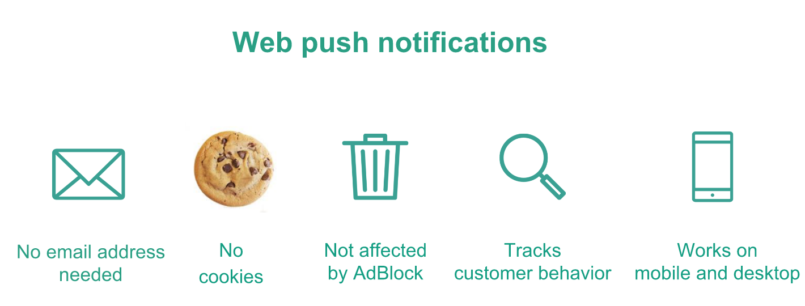
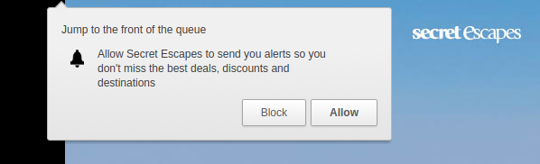
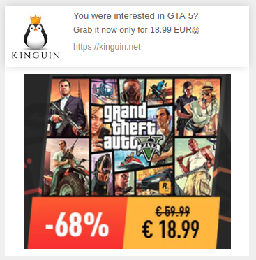
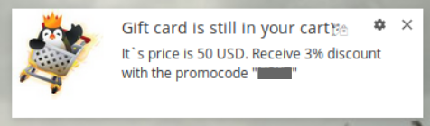
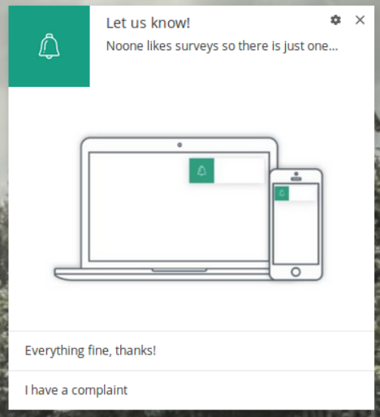
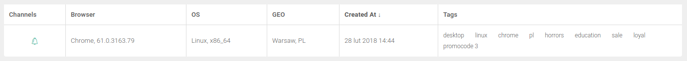

Web push notifications are a new player among online marketing channels. They have quickly become an important element of the **marketing mix of many companies around the world**. At the end of 2017, all RFC’s (documents created by teams responsible for the development of various web browsers) confirmed that web push notifications will be supported by all current and future versions of Google Chrome, Opera, Mozilla Firefox, Edge etc.

This opens a new channel for reaching over **80% of internet users**, as estimated by NetMarketShare. This article will show you how to use web push notifications in **5 practical examples that can be implemented in any company**.

## 1. Building a database of subscribers who don’t respond to newsletters

According to the 2017 [Email Signup Benchmarks report](https://sumo.com/stories/email-signup-benchmarks), published by Sumo, **the average subscription rate for newsletters is 1.95%**. Only 10% of the best email marketers reach a score of 4.77%.

For example, a survey conducted among PushPushGo clients shows that the rate of registration for web push notifications is on average from **5 to 10%**. Where does the difference come from?
Web push is a completely new marketing channel. While many internet users often associate newsletters with spam or intrusive sales content, web notifications have not yet managed to build a bad reputation.

The subscription itself is done within one click, without the need to enter any data or filling out a form, which translates into a higher conversion rate.

### Example

Your web push database is a chance for you to draw the interest of people who are afraid of spam or simply do not want to clutter their email inboxes with newsletters. Notifications disappear after closing or clicking on them, **without requiring any extra action from the subscriber** (like deleting an e-mail).

To convince visitors to subscribe to your notifications, first of all try to gain their trust in this new communication channel. Be transparent, use the language of benefits and describe what content you will send and how often so that they know what to expect.

*Subscription form to web push notifications, SecretEscapes.com*

Once you build your own web push database, you can use it for **educating clients** and for **nurturing leads**. By creating your own web push automation flows, you will schedule emails at the right time (for example, immediately after subscribing and three days after) or create entire communication cycles.

This is a good opportunity to convey information that will build a stronger image of your brand - using, for example, **testimonials of your existing customers or case studies**.

To quickly "move" subscribers down the sales funnel, you can include educational content in notifications. Things like a buyer’s guide to a certain product will make it easier for recipients to make future decisions and lead them to their first purchase.

## 2. Increase returns to your website

How do you monitor your daily and monthly return visitors? What are you doing to draw them  back? Is your **RVR** (return visitor rate) maintained at a satisfactory level?

**The cohort analysis** that you run on your website can also help you track user behavior. Thanks to integration with the web push platform, you can automatically monitor which of them have not visited the site within, for example, the last month and prepare a notification that will then be automatically sent to them.

### Example

Let's assume that a given web push subscriber has not appeared on your website for 30 days. It is possible that he or she became interested in your competition’s offer or simply forgot about your brand. Your goal is to attract them back to your site.

All you need to do is to set the right web push automation scenarios so that the system automatically detects which recipients have not appeared recently on the website, and then send them a ready-made notification.

To increase the effectiveness of the message, notification can refer to:

- **recently viewed products**,
- **last-clicked url address**,
- **last-viewed category of products for a given price**

*Web push notification, Kinguin*

You will then determine whether you want to divide your subscribers into loyal and other subscribers on the basis of, for example, how often they visit your site. You can prepare à campaign for each of these groups to confirm the subscription or thank them for their loyalty with, for example, a discount.

## 3. Conversion optimization and abandoned carts

**The Baymard Institute**, an international research agency, publishes statistics on abandoned carts, collected from various sources around the world every year. Currently, it is estimated that over [69% of carts are abandoned by e-commerce clients](https://baymard.com/lists/cart-abandonment-rate).

It is difficult to find objective information about other types of conversions that take place on your website. How many people fill in, for example, the registration form for a webinar? What percent of visitors to a given site start to fill in information but don’t finish?

**Web push automation allows you to reach out to these people at any time** from the moment they left your website, even when the recipient is already browsing the competition’s page. This notification will display in the corner of the browser of their computer or mobile device automatically.

### Example

The web push system constantly monitors which subscribers abandon a cart or don’t finish  completing a forms. It also verifies the value of the cart and whether such "abandonment" takes place for the first time or is repeated, for example, in order to receive an additional discount.

You can plan several different notifications that will be received by the recipient depending on the value of the cart or the amount of time that has passed since the transaction was not completed. People who try to "extort" such an unplanned discount can be labeled in their database as "regularly abandoning" and you can choose to not offer them discounts in the future.

*Rich web push notification, Kinguin*

## 4. Even better customer service

**Call to action buttons** enable the possibility of placing two alternative links in one web push notification. This means that depending on which button the recipient clicks, they will be redirected to the appropriate landing page.

By placing two call to actions in the notification, you also increase the chance of increasing the click-through-rate. Seeing two options, the recipient does not think about whether to click on the notification only, but which of these options displayed is more inviting.

### Example

To monitor whether the level of your service is satisfying clients, you can send automatic notifications after the transaction.

Such notifications can be sent a certain number of days after completing the purchase and may contain two evaluation options:

- **"Everything is OK"** - the button directs to a thank-you page
- **"I have a complaint"** - the button directs to a survey page after purchase to find out what went wrong

*Web push notification with actions, PushPushGo*

This allows you to quickly identify why your customers are dissatisfied with your service and gives you a chance to solve these problems in order to win back your customers from the competition.

## 5. Tracking audience interests

The database of web push subscribers is as valuable as a traditional newsletter database. It gathers people who were so interested in your company's products or services that they don’t wanted to miss out on any information about your company in the future.

Are you sure that the content you share with subscribers always corresponds to their interests? In the case of web push, you can easily solve this problem because **all recipient behavior is monitored**, which makes it easier to segment the database later due to what they were searching for on the page or what articles they’ve read so far.

### Example

Before you start sending your own web push campaigns, make sure that the platform you use can automatically collect information about what products or categories have been displayed by specific subscribers.

Thanks to this, every person who has, for example, viewed a certain pair of shoes will be tagged with that product. In the same way, you can segment your database based on what URLs have been viewed or action performed (clicks, views, purchases, etc.).

Are you thinking about whether web push notifications will work in your company? You’ve got nothing to lose because during the free trial period we will create a dedicated web push strategy for you and efficiently guide and support you through the implementation process.

If you have any questions about how web push works or what it can do for your business, get in touch today and we’ll be happy to walk you through everything. You can reach us via chat, e-mail and phone so let’s talk!

