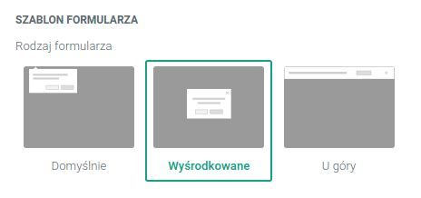
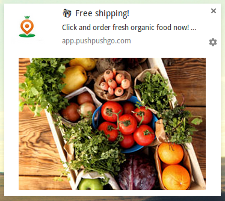

Web push notifications have quickly established themselves as an essential tool for *quickly generating traffic* and increasing sales in ecommerce.

Getting the attention of customers is hard but PushPushGo customers who optimize their campaigns can even reach click-through rates of *over 50% in their campaigns.*

What’s the best way to get such fantastic results?

Let’s take a look at *4 tips* that will push the effectiveness of your web push notification campaigns to the next level and unlock the full potential of your marketing efforts.

## 1. Perfect your sign-up page

A tool for directing new subscribers to your sign-up form is the primary way to ensure success in your campaigns. The better and more persuasive your sign-up form is, the bigger the potential audience for your message.

### Use the right language!

There are three recommended ways to display your sign-up form on your site for the best results:

- **a pop-up** in the middle of the page
- **a horizontal banner** across the top
- **a square window** in the upper left corner of the screen

Finding the right place to promote your sign-up form is just the start. Now it’s time to consider the language you use when communicating with visitors to your site.

> **Skuteczny formularz zapisu na notyfikacje web push:**
> - It contains content in a language adapted to the recipient - remember that you can create multiple projects in various languages in a single PushPushGo account.
> - It also has a clear message delivered in the language of benefits by informing recipients about how they benefit from joining (exclusive benefits, discounts, etc.).

## 2. Prepare the right content for your web push notifications

Get better results by communicating in the language of benefits and an emphasis on what can be gained by clicking on a link in your message.

### Use graphics

It’s important to remember that images are processed 60 thousand times faster than text - that’s why it’s often helpful to include, for example, an image of a product in your message.

> **Effective web push notifications have:**
> - Clear calls to action like **click here** or **enter**. Remember that web push notifications are a new form of marketing communication and not every recipient knows that they can click on the message that they see, which can have obvious consequences for your campaign stats.
> - Attractive and professionally made **images** that get the recipient’s attention.
> - A link that leads directly to a **product page**. Make it as easy as possible for customers to find what they’re looking for so they can complete the sale.
> - For price promotions, it’s often a good idea to set a **time limit for the offer** to create a sense of urgency and persuade customers to place an order now.

## 3. Select the right recipients for your web push campaign

PushPushGo’s settings allow you to choose to send your message to **all your subscribers** or only to **certain segments** based on recently visited subpages or products.

Of course, you can also send messages to your entire subscriber database for things like seasonal promotions or other offers.

Better results always come with focused, targeted campaigns that send the right messages to the right subscribers. Use segments based on declarative and behavioral data to personalize the content of your campaigns.

Tags identifying subscribers by, for example, gender, can be found in the Subscribers section.

> **When targeting your web push campaign:**
> - Consider which subscribers are likely to be **most interested in your product**, not only on the basis of demographic or behavioral information but also **complementary products** that match a customer’s purchase history.

## 4. Optimize the sending time of the campaign

Web push notifications reach your subscribers almost instantly and creating them takes just a few minutes. This immediate impact can make tempting to flood subscribers with messages but always remember that, just as in email marketing, this is the best way to force customers to leave your mailing list.

Always pay careful attention to the frequency of your messages and monitor the number of resignations from your mailing list to look for any correlation. **Find the right balance and contact subscribers** often enough to get the results you want but not so often that your messages become irritating or unwelcome.

The kind of information you send is also important. Go beyond only sending sales-oriented messages and share other kind of content liked educational texts and other materials that help customers understand your product more.

**The time you send your web push notifications** related to sales is especially important in ecommerce. General information or content that helps to build a brand can be sent any time.

For sales offers, remember that web push notifications disappear after a few seconds and there’s only a small chance that potential customers will make a purchase during working hours. Try to send such campaigns during afternoons and evenings.

> **During web push notification campaigns:**
> - Take the rhythms of the lives of your subscribers into consideration when planning your sending times and make sure you contact your audience **t the right time**.
> - Send campaigns at a frequency that won’t push subscribers to leave your subscribers list.

These tips are meant as general advice since no one knows your subscribers and their preferences as well as you do. Use these guidelines to find out more about them and optimize everything about your web push notification campaigns.

Put data from past campaigns and your own observations about what your subscribers respond to together to get the best results possible!

