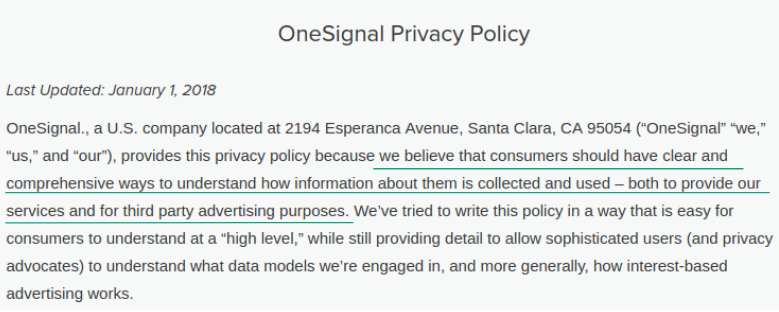
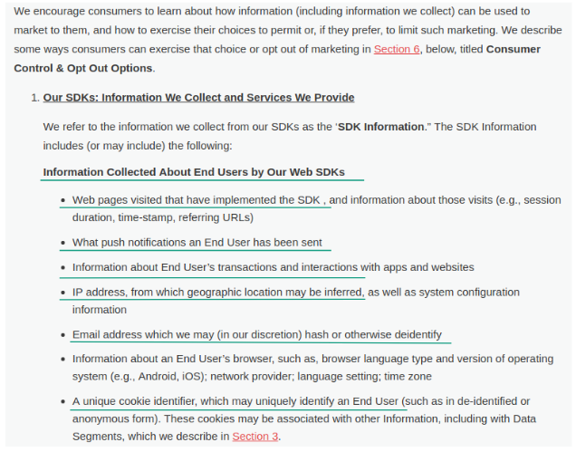
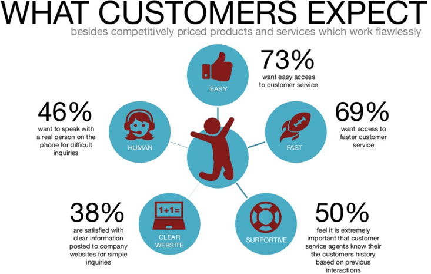

Web push notifications have caused a breakthrough in the field of online marketing. Due to the possibility of **immediate contact with the subscriber** without the need to reach an email inbox, when it comes to performance indicators, this young invention has quickly come to dominate the traditional newsletter.

You already know that there are plenty of platforms on the market dedicated to sending web push notifications. Their functionalities and prices are very similar to each other and it's easy to get lost in all the different offers. Still, **there are many ways for some platforms to stand out in particular areas**, including things like ensuring the necessary protection of personal data and support in the implementation of the platform. 

If you are struggling to get a better idea of which web push notification application is right for you, we’ve put together **a list of important criteria to consider**. Every question on the list will bring you a little closer to being able to select the platform that will help to take your marketing to the next level. 

We’ve included answers to the questions so that you know what to look for when considering different offers. When you’re done, you can even download a ready checklist that you can send to anyone that you want to get more information from. 

Ready? Let’s dive in! 

## 1. Does your platform use the OneSignal engine or other providers?

OneSignal is a web push multiplatform which, in addition to allowing companies to send notifications, also **provides an engine** that allows you to build your own web push platform.

A potential concern or problem could be the fact that this platform is free. We all like free stuff, I know, but in the online world nothing that is free is actually free. In its privacy policy, OneSignal directly informs us that part of its business model is cooperation with third parties for advertising purposes.

*Source: OneSigna Privacy Policy, as of 8.02.2018* 

To make free use of the platform, OneSignal collects, processes and transmits data collected on the websites of its clients to third parties:

- **what web push** campaigns you send,
- **what transactions** your clients complete,
- **email addresses** that they use on your website,
- **IP addresses** of your clients,
- or **cookies** that allow you to identify your customers.

Thanks to the integration code that you paste on your website, it’s possible to send notifications.

*Source: OneSignal Privacy Policy, as of 8.02.2018* 

The risks that arise for you and your company from this include, for example, sharing commercial know-how with unspecified third parties and what products you sell at what price.

Regarding the changes in personal data protection introduced by GDPR, uncertainty should primarily arise from **obtaining your clients' email addresses** (which are personal data) and marking them with cookies, which are later resold.

Under the new EU regulation, you are obliged to inform your clients about it and get their consent for data processing or profiling. This could be difficult because OneSignal does not inform you exactly about which companies are given this data and for what specific purpose, like better targeting of ads on a given advertising network, etc. 

**The perfect answer to the question**

*We do not use the OneSignal engine or any other intermediaries of this type. Our platform is a proprietary solution, so we have full control over what happens with our clients' data and we can confirm how, where and why they are collected for you.*

**What to pay attention to** 

There are many web push platforms that use the OneSignal engine and they often do not inform their customers about the consequences that are associated with it. This varies from one web push platform provider to another, so ask someone from your IT department for help if you have any doubts. 

## 2. Can I transfer a subscriber database from your platform to another one?

Many marketers assume that exporting a list of subscribers from one tool and importing them to the next should be no problem at all.

In the case of a web push database, such an operation is possible only if the current provider creates GCM/FCM keys for you before you start collecting your own recipient database.

**The perfect answer to the question**

*Of course, if you want to export subscribers in the future, we will provide you with GCM/FCM keys and explain how they work.* 

**What to pay attention to**

Make sure that the web push provider does not offer to export data about subscribers in, for example, **CSV format**. This is only analytical data which can be opened and viewed in Excel, but will not be suitable for importing to another platform for sending web push campaigns.

## 3. Does your integration code slow down the website and will there be a need to change it in the future?

To start collecting web push subscribers on your website, you need to paste in the integration code generated from the platform you will use.

Like any IT tool, it can be created in a more or less optimal way, which affects the **speed of loading your site** and, consequently, its **position in Google search results**.

The second issue that you should check is whether the code is pasted once or you **will have to change it** every time the platform provider updates it. This may not be a huge issue but it still makes demands on your time. 

**The perfect answer to the question**

*Our integration code is written in ... ...., It does not slow down the loading of your website, nor does it need to be changed in the future.*

**What to pay attention to**

When in doubt, you can always ask the developer who will insert the code on your website. Seeing the structure of the script, he will be able to verify whether it will have to be changed in the future.

## 4. Do I have to paste your additional script or code on my website to use marketing automation?

Web push automation modules, depending on how they were designed, can work in different ways. They can all be effective in different ways but you should look for the **most convenient solution for you**.

What does this mean? For example, if you have 1000 products in your online store and you will **have to mark each of them with a special script** embedded on your website to automate campaigns, you will have to spend a lot of time getting it done. 

There are many effective ways to automate web push notifications without having to waste time pasting unnecessary scripts into your site. 

**The perfect answer to the question**

*Our marketing automation module is a fully functional tool once you paste the integration code into the source page.*

**What to pay attention to**

The key is the number of additional operations that you will have to perform on your side from the moment of integration with the web push provider.

Of course, pasting one or two additional parameters, especially when a dedicated solution that you ask for requires it, it is not the end of the world. Having to do it hundreds of times is another matter. 

## 5. What customer support do you offer?

When deciding on a web push platform, you should think about not only the tool itself, but the necessary support you might need when you use it. 

You will spend a lot of time looking for your own solutions instead of using ready-made ones. You are not an expert in everything, and sometimes **access to support materials** can be just what you need to make your campaign a success. 

What to look for:

- **free self-service materials**: tutorials, videos, case studies, etc. accessible at any time and in convenient formats, 
- **communication channels**: you can use to contact support any time you need it, 
- **dedicated support**: sometimes it's worth letting the experts take over. Using a ready web push strategy can speed up your activities and save you from making simple mistakes. 

**The perfect answer to the question**

*Our customer service department remains at your disposal, available in your package free of charge ...... .. Support is available 24 hours a day, via chat, email and phone.*

*We also create dedicated web push strategies for our clients and we are happy to advise you on all matters related to this.*

**What to pay attention to**

Before you sign a contract with a web push provider, make sure you know what you’re getting. Opinions about a given platform, whether on Facebook or Google My Business, will at least partly show you what level of customer service to expect.

Bad customer service is something that you remember and many users immediately share their opinions on social media. Knowing that a given supplier has very low quality of support can help you avoid disappointment in the future.

*Source: http://www.slideshare.net/thorleifhallund/why-service-matters*

Now you are fully prepared to **make an informed decision** about choosing the perfect web push notification provider for you.

You can download a free checklist below that you can send to companies to get the answers you need. Good luck in your search!

<a class="btn" href="checklist.png" target="_blank" download>
Download the checklist
</a>

