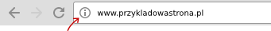
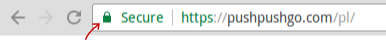
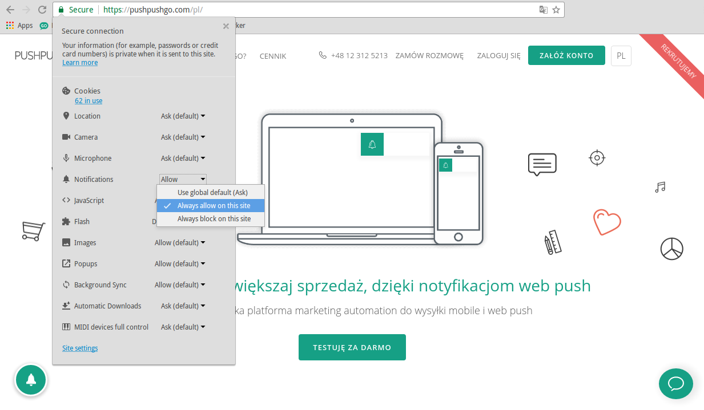

To enable web push notifications on a particular website, click on the icon located in the top bar, before the URL:

Icon on website without HTTPS:

Icon on website with HTTPS:

When you click on the icon, you will see a panel with browser settings, such as geolocation, camera and microphone access, and the like.
Most important is that we can just set up permission to receive web push notifications from a given domain there.

Search for *"Notifications"* item in the list of settings and choose *"Always allow on this site"* from given options.

Since then, You will receive notifications from that domain :)

