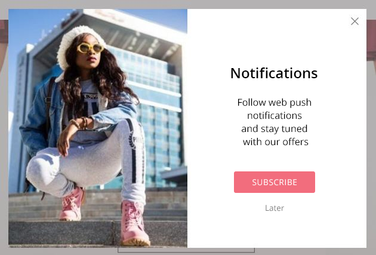
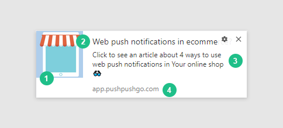
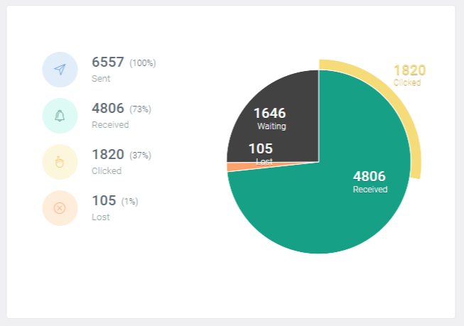

Email marketing generates an average of 18% of all orders in ecommerce. With the development of the possibilities of modern web browsers, a new competitor has arrived.

Do you share a newsletter in your online store? Have you noticed that your messages often land in spam folders? Or maybe your customers don’t want to sign up for email notifications? Web push just might be the solution for you.

We’re going to take a look at the most important differences between newsletters and web push notifications that you’ll notice in the context of an internet store.

## E-mail and web push - similarities

To start out our comparison of email and web push as marketing tools, let’s take a look at what they have in common.

Web push notifications support online stores in the same way the email does, in that they both:

- increase traffic and generate sales (web push can even display when users are viewing another page)
- build brand awareness and loyalty
- educate potential customers through, for example, articles related on uses and applications for your product
- carry out surveys and gather customer feedback

Both email marketing and web push operate on the principle of permission marketing. To receive any notifications, recipients first have to sign up and request them. This means they are more engaged right from the start since they voluntarily chose to get information from an online store.

Both mediums have the same ultimate goal - to get users to **click on a link that takes them to a landing page**. The appropriate graphics or persuasive content can be just the thing to get the job done.

Marketers also pay attention to how often subscribers return to, for example, use a rebate code at a time that is convenient for them.

In the case of certain web push platforms, users have the option of returning to past messages in a **dedicated inbox**, just as in email marketing.

The difference is that they only contain messages from your internet page. This helps to focus the attention of recipients and avoids distractions that can appear in email inboxes. This is another reason why web push has a better conversion rate.

## Newsletters and web push - differences

The examples above show that email marketing and web push marketing are similar tools in terms of how they work but what about the differences? Here are **8 important differences** between email and web push in the context of ecommerce.

### 1. Time needed to create campaigns

Email marketing is all about sending a message to subscriber inboxes. Designing the message requires knowledge of the rules that govern spam folders and how messages display on different screens. Also, the requirements of different email service providers are another factor that must be considered.

Web push notifications are delivered by internet browsers. The rules for creating messages are the same for all browsers and so there is no risk of a web push campaign being ruined by a small mistake that causes it to be directed to spam folders or to display improperly.

Web push campaigns can be created in just a few clicks and don’t require any knowledge of programming or marketing. It’s enough to put together a few basic elements to make a great campaign:

- **eye-catching visuals** that draw attention to your product
- a **title** that captures the essence of your product, maybe enhanced with emoticons
- **main text** describing your product
- a **link to a landing page** where you want customers directed after clicking on the message

> **Time required to prepare campaign**

> - **Email: > 5 minutes**. It can be as long as you want and contain any number of graphics and links. Emails have to be tested before the campaign is sent for various technical reasons including elements causing them to be directed to spam folders.
> - **Web push: < 5 minutes**. Web push notifications contain a limited number of characters and content, a single graphic and a link. They don’t require any testing before sending and there are no technical issues that can affect their deliverability.

***

### 2. Sending time

The time needed to create and deliver an email marketing campaign can vary greatly depending on the complexity of the design and number of addresses in the database. A large number of subscribers may require several hours to reach.

Since web push notifications are supported by internet browsers, they can delivered in real time. This means you have the power to react immediately to customer actions in online stores when their engagement and your chances for conversion are highest.

> **Time required to deliver campaign**

> - **Email: > a few minutes** - You have no control over how much time it takes to deliver email campaigns.
> - **Web push: < 10 seconds** - Web push notifications reach browsers almost immediately.

### 3. Subscriber reach

Web push notifications are supported by the most commonly used modern internet browsers and mobile platforms, allowing you to reach more than 80% of global internet users.

> **Subscriber reach**

> - **Email:** - About *97%* of internet users
> - **Web push:** - About *80%* of internet users + potential subscribers who avoid spam since it isn’t an issue in web push notifications  because it’s so easy to unsubscribe from unwanted messages.

### 4. Deliverability

The deliverability of email marketing campaigns can be significantly limited by anti-spam filters that can divert your message away from inboxes because of small technical errors or because of past complaints about sending spam.

On the other hand, there is nothing that can stop web push notifications from displaying in the internet browsers of subscribers, even ad-blockers that stop advertisements from appearing. Web push deliverability is only affected by the number of subscribers who are accessible by desktop of mobile devices after the message has been sent.

> **Campaign deliverability**

> - **Email:** - Deliverability depends on technical factors like the reputation of the IP address used to send the message and past subscriber reactions.
> - **Web push:** - The only limitation on deliverability is the number of subscribers who have open internet browsers at the time the message is sent.

### 5. Storing personal data

Email addresses are considered to be personal data in nearly all legal jurisdictions. 

With web push notifications, your subscribers sign up with just two clicks and you don’t need to ask for their email address or any other data. This means you are also free from the sometimes problematic issue of data storage. 

> **Obligations related to the collection and registration of personal data**

> - **Email:**  you have the legal obligation to register and protect personal data.
> - **Web push:** you don’t need to ask for any personal data from subscribers.

### 6. Unsubscribe process

If marketers don’t place unsubscribe links in their newsletters or make leaving their database difficult, it can result in harassment of recipients and having their messages labeled as spam.

With web push, recipients can choose to resign from any further notifications at any time. This helps to make it easier for marketers to follow the rules of permission marketing and avoid interrupting subscribers with too many messages.

> **The spam threat**

> - **Email:** recipients are usually dependent on the sender to include a link that makes it possible to resign from a mailing list.
> - **Web push:** recipients can remove themselves from a mailing list at any time through their internet browsers.

### 7. Campaign statistics

When it comes to getting engaging subscribers and getting a response, web push leaves email far behind. With web push, there’s no need for subscribers to first go to their email accounts, open a message and then click on a link. Links appear in the notifications themselves and just one click is required to direct a subscriber to a landing page. Web push campaigns can deliver a **CTR of around 20%.** 

*Reports panel at PushPushGo*

> **Average campaign CTR**

> - **Email:** 4.3%
> - **Web push:** 20%

### 8. Speed of subscriber database growth

The fact that email subscriptions require users to provide their email addresses has a significant impact on the rate of growth of subscriber databases. The double opt-in model, which requires subscribers to access their inboxes and click on a link, is another obstacle to quick growth. Web push recipients don’t have to provide any personal information, making it easier and faster for them to join.

> **Subscriber database growth**

> - **Email:** moderately fast
> - **Web push:** very fast

***

### Summary

It's not that it's unclear, it's that it doesn't fit the rest of the text, which is supposed to be about differences between EM and WP. This text says both should be used and it seems to me (my opinion) that it should say that the differences show that WP is at least as good as EM and often better.

