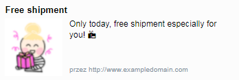
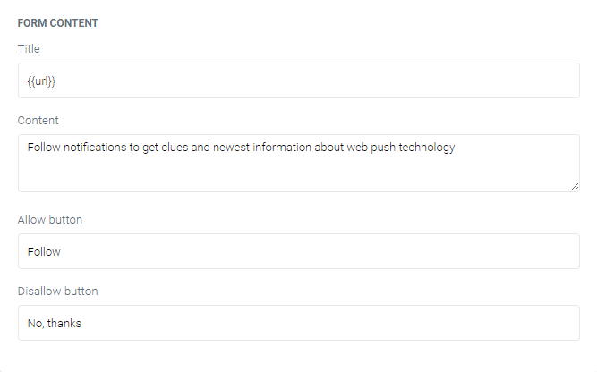
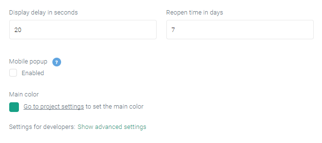
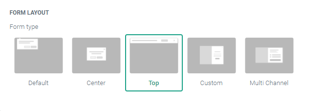
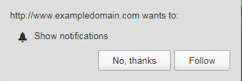
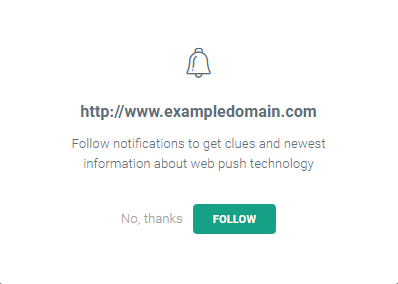
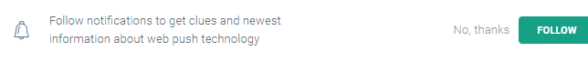

Web push, or **web push notifications**, are a new online marketing channel that went live in April of 2015. It’s a technology that allows marketers to communicate **in real time** at exactly the moment when, for example, they’re viewing a product or are about to leave a site.

Perhaps you’ve seen a web push notification in your **favorite online store** or maybe your competition is testing them out. Whatever the reason, if it’s time for you to learn more about web push notifications, you’re in the right place so let’s take a look at what they can do for your business!

## 1. What are web push notifications?

Web push notifications are **small rectangular messages** that appear in the corner of computer or smartphone screens via the web browser in use.

As with email marketing, web push notifications let you establish one-on-one communication with your subscribers. In this case, however, **you don’t need any addresses or other data**. This is made possible by identifying subscribers on the basis of other information stored in the internet browsers they use.

This means that you don’t have to collect any personal data from subscribers in order to stay in contact with them.

## 2. What do web push notifications look like?

Web push communications may appear differently depending on the browser being used. Pictures below show differences between Google Chrome and FireFox notifications:

Source: Web push notifications in Google Chrome, Windows

Source: Web push notifications in Firefox, Windows

Despite these small differences, all web push notifications have 4 common elements:

- **distinctive graphis** for attracting the attention of recipients
- **title** or a substitute like emoticons
- **main text** that expands on the title
- **link to a website** to send recipients exactly where you want them to go

## 3. How do web push notifications work?

Web push notifications are supported by the internet browsers used by your recipients. This means that your campaign is delivered as soon as you hit “Send” and you don’t need to worry about **cookies, anti-spam filters or ad blockers**.

Just like email marketing newsletters, web push notifications are sent only to those who have expressed their desire to receive them. Subscribers decide what kind of notifications they would like to receive, meaning that your message can reach exactly those customers who are most likely to be interested.

To resign from further notifications, all anyone has to do is go to the browser settings, meaning there is no threat from spammers. The only way to receive web push notifications is by explicitly asking for them.

In order to enable web push notifications on your site, it’s enough to paste a small piece of integration code script into the page’s source code. You can also determine the frequency with which the signup form is displayed to particular users and after how much time it appears when a session is initiated.

To increase the effectiveness of your sign-up form, you can personalize it so that it better matches the overall appearance of your site.

There are 4 options for the placement of a sign-up form on your site:

**Default form** - these are familiar to many online since they look like a browser notification related to, for example, the location of the computer. Its familiar form inspires trust and confidence.

**Centered form** - a pop-up form that is more aggressive and more effective since it’s hard to ignore. The basic version contains just a bell icon and personalized text.

**Top bar** - This kind of display only contains bell icon and text. Like the default form, it’s not invasive and doesn’t interfere with the purchasing process.

**Personalized form** - This also appears in the form of a pop-up window but it contains additional personalized graphics suited to the design of the page. This is the best-converting sign-up form because it is highly visible and its design inspires confidence.

After signing up through a subscription form, recipients can also receive automatic **welcoming message**. These are frequently used in ecommerce to offer **discount codes**  or other incentives to make a first purchase as well as exclusive content available nowhere else. Information about the benefits of signing up for web push notifications can helps to boost the number of new subscribers.

Also, all the messages you send can be can stored in a dedicated **inbox on your site.** Marketers know that subscribers often return to newsletters in their email inboxes. Now, your customers can do the same with discounts and other offers sent through web push notifications.

## 4. How effective are web push notifications?

Web push notifications are supported by all modern internet browsers and mobile platforms and can reach about **80% of all internet users** on the planet. This makes them an ideal marketing channel to complement your sales efforts, particularly with customers who avoid newsletters out of concerns about spam.

Because of its highly visible presentation, web push can create a **strong sense of urgency**. Reactions to notifications take just a couple of seconds - closing or clicking - and that’s why web push can achieve CTRs of up to **20%**, **five times higher than email marketing**.

Do you run a newsletter for your store? Take a look at these [8 key differences between newsletters and web push notifications](https://pushpushgo.com/en/blog/post/newsletter-vs-webpush/).

## 5. How and where should you use web push?

Web push works for any company that wants to contact customers in a familiar space and build social engagement around its brand.

Depending on your needs, web push campaigns can fulfill two roles:

- **sales** (by generating customer traffic, advanced targeting of discounts and rebates, up-selling and cross-selling)
- **branding** (through the distribution of educational content, ideas for product uses and essential knowledge during the conversion process)

The power of web push to start and maintain a unique channel of communication with subscribers and react to their actions during the sales process makes it the ideal medium for optimizing conversions in online stores.

