Web push, a dokładnie **notyfikacje web push**, to nazwa nowego kanału marketingu internetowego, który jest dostępny globalnie od kwietnia 2015 roku. To technologia, która daje możliwość komunikacji **w czasie rzeczywistym**, właśnie wtedy, gdy Twój odbiorca przegląda dany produkt a nawet wtedy, gdy opuścił Twoją stronę.

<iframe width="560" height="315" src="https://www.youtube.com/embed/cIFN8DIBW24" frameborder="0" allowfullscreen style="margin: 0 auto; display:block;"></iframe>

Widziałeś powiadomienia web push w **ulubionym sklepie internetowym** a może Twoja konkurencja już testuje ten kanał marketingowy? Zobacz co musisz wiedzieć o web push, żeby stwierdzić czy to narzędzie będzie przydatne dla Twojego biznesu.

***
Zobacz też:

***

- [5 zastosowań powiadomień web push dla każdej firmy](http://centrumsprzedawcy.pl/5-zastosowan-powiadomien-web-push-dla-kazdej-firmy/)

- [4 wskazówki, które zwiększą skuteczność Twoich kampanii web push](https://pushpushgo.com/pl/blog/post/improve-push-campaigns/)

## 1. Co to jest web push?

Web push to **małe prostokątne komunikaty**, które wyświetlają się odbiorcy w rogu ekranu komputera lub smartfona za pośrednictwem przeglądarki internetowej.

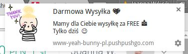

Podobnie jak email marketing, pozwalają one na prowadzenie z odbiorcą komunikacji 1 do 1. Jednak w tym wypadku **nie potrzebujesz, ani jego adresu email ani żadnych innych danych.** Dzieje się tak, ponieważ Subskrybent jest identyfikowany na podstawie informacji, które przechowuje na jego temat przeglądarka internetowa, z której korzysta.

Oznacza to, że nie musisz zbierać żadnych danych osobowych i np. rejestrować ich w Giodo, aby pozostać  w kontakcie ze swoimi odbiorcami.

## 2. Jak wygląda powiadomienie web push?

Komunikaty web push różnią się między sobą wyglądem w zależności od tego na jakiej przeglądarce internetowej są wyświetlane.

Przykładowo, w przeglądarce Mozilla Firefox (system operacyjny Linux), są one nieco mniejsze niż na Google Chrome a dodatkowo są bardziej „wypukłe”.

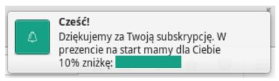

*Źródło: Powiadomienie web push Mozilla Firefox, Linux*

Nie jest również na nich wyświetlany url, z którego zostało wysłane powiadomienie.

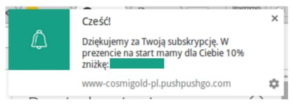

*Źródło: Powiadomienie web push Google Chrome*

Co więcej, tylko Google Chrome pozwala na korzystanie z dodatkowych funkcjonalności powiadomień:

- tzw. **rich push** czyli większego zdjęcia, o szerokości ok. 200 pikseli, które sprawia, że notyfikacja jest jeszcze bardziej widoczna na pulpicie odbiorcy a prezentowany produkt mocniej przyciąga uwagę,

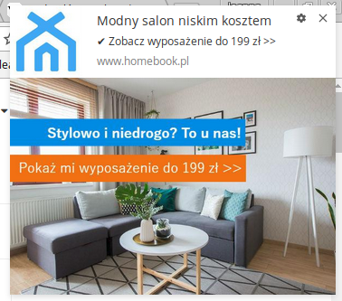

*źródło: notyfikacja rich push, Allani*

- **przyciski akcji** czyli dwa alternatywne linki, które można umieścić w notyfikacji pod odpowiednim call-to-action, co pozwala jeszcze mocniej zaangażować odbiorcę w interakcję lub poznać jego preferencje co do prowadzonej komunikacji.

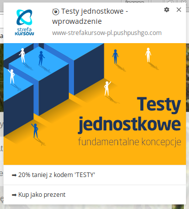

*Źródło: notyfikacja web push z przyciskami akcji, Strefa Kursów*

Mimo tych różnic każda notyfikacja web push posiada *4 stałe elementy*:

- **grafikę wyróżniającą**, której celem jest przyciągnięcie uwagi odbiorcy,
- **tytuł** (możesz również dodawać do niego emotikony),
- **treść główną**, która jest rozwinięciem tytułu,
- **link do strony**, na którą odbiorca zostanie odesłany po kliknięciu komunikatu.

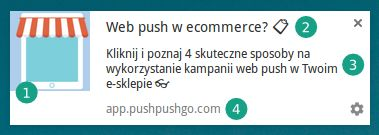

## 3. Jak działa web push?

Powiadomienia web push obsługiwane są poprzez przeglądarkę internetową, z której korzysta Twój odbiorca. Oznacza to, że Twoje kampanie zostaną dostarczone od razu, gdy klikniesz przycisk „Wyślij” i nie musisz się martwić ani o tzw. **ciasteczka (Cookies)**, ani o **filtry antyspamowe** czy **oprogramowanie blokujące wyświetlanie reklam** (tzw. ad-blockery).

Dodatkowo, podobnie jak w przypadku newslettera, komunikaty web push wyświetlane są jedynie tym odbiorcom, **którzy wyrazili zgodę na ich otrzymywanie**. Subskrybent sam wybiera z jakich stron chce dostawać powiadomienia, oznacza to, że otrzymywane oferty z dużym prawdopodobieństwem będą odpowiadać jego potrzebom czy zainteresowaniom.

Aby zrezygnować z subskrypcji wystarczy zmienić ustawienia w przeglądarce internetowej, co powoduje, że w tym kanale nie ma żadnego zagrożenia ze strony spamerów. Jeśli odbiorca nie zapisze się samodzielnie na powiadomienia, nie będzie ich po prostu otrzymywać.

Żeby włączyć powiadomienia web push na swojej stronie wystarczy wkleić w jej kodzie niewielki skrypt. Gdy to zrobisz, możesz też wybrać jak często formularz zapisu będzie wyświetlał się osobom odwiedzającym Twoją stronę i po jakim czasie od wejścia na stronę to nastąpi.

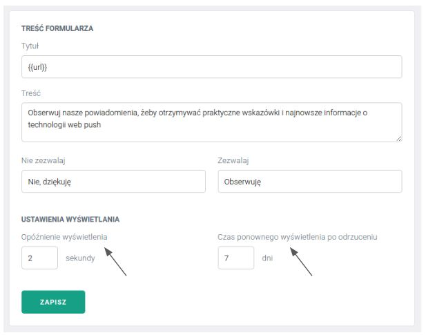

Aby zwiększyć skuteczność formularza zapisu na powiadomienia możesz go również spersonalizować tak, aby stanowił spójny element Twojej strony internetowej.

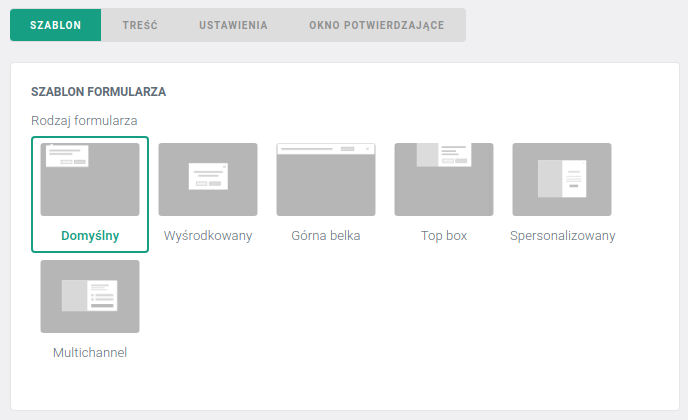

Masz do wyboru 6 opcji umieszczenia swojego formularza zapisu:

**Formularz domyślny** - jest on dobrze znany większości internautów, gdyż przypomina komunikat przeglądarki, np. o tym, że chce ona znać położenie danego komputera. Dlatego szybko budzi zaufanie odbiorcy.

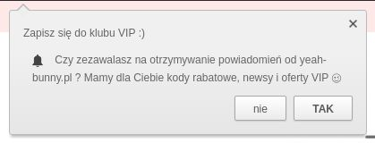

Dodatkowo jeśli, Twoja strona www korzysta z **zabezpieczonego protokołu https**, wystarczy tylko jedno kliknięcie, aby odbiorca zapisał się za jego pośrednictwem na powiadomienia. Powoduje to, że ten formularz ma najwyższy wskaźnik zapisów, jest więc najskuteczniejszy, jeśli chodzi o szybkie budowanie własnej bazy web push.

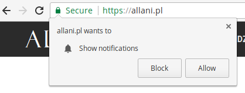

**Formularz top box** - to rozwinięta forma formularza „górna belka”, która wyświetla się na środku, u góry strony i zawiera również spersonalizowaną grafikę.

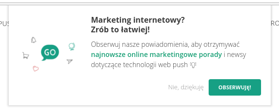

**Formularz wyśrodkowany** - to tzw. wyskakujące okienko (pop-up), najbardziej agresywna forma formularza, ale jednocześnie najbardziej skuteczna, gdyż trudno ją przeoczyć. W podstawowej wersji zawiera on tylko symbol dzwonka i spersonalizowany tekst.

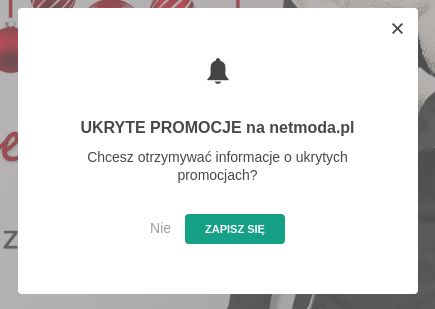

**Formularz górna belka** - to cienki pasek, który wyświetla się na całej długości strony internetowej. Zawiera jedynie symbol dzwonka oraz tekst. Podobnie jak formularz domyślny jest on mało inwazyjny i nie zakłóca procesu zakupowego Twojego odbiorcy.

**Formularz spersonalizowany**- to również formularz w formie pojawiającego się okienka, jednak zawiera on dodatkowo spersonalizowane zdjęcie, które może pasować wizualnie do projektu strony. To jeden z najlepiej konwertujących formularzy zapisu, ponieważ jest jednocześnie dobrze widoczny i budzi zaufanie dzięki spójnej wizualnie grafice spójnej wizualnie z szablonem strony.

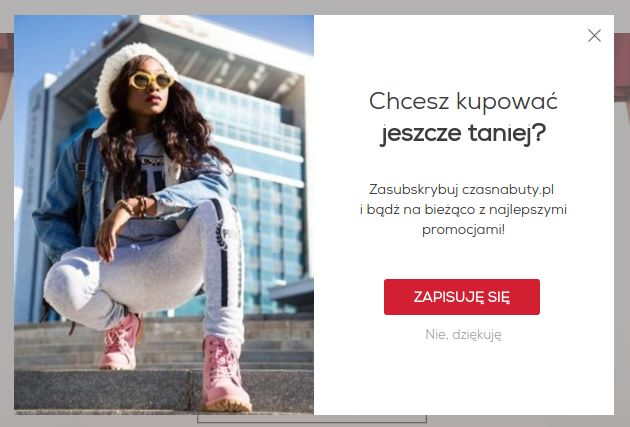

Dodatkowo może on zawierać **centrum preferencji**, w którym Twoi odbiorcy sami mogą potwierdzić jakie treści chcą od Ciebie otrzymywać lub czym się interesują. Takie informacje ułatwią Ci targetowanie wysyłanych do nich komunikatów, co przełoży się na zwiększenie ich skuteczności.

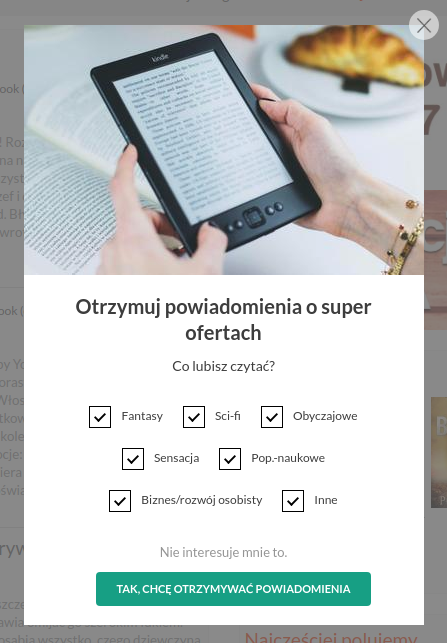

Po zapisaniu poprzez formularz subskrypcyjny, odbiorca może również otrzymać [automatyczną wiadomość powitalną](https://pushpushgo.com/pl/pages/poradnik/#scenariusz-1). Wielu marketerów czy właścicieli ecommerce wykorzystuje je, aby zaoferować nowym subskrybentom dedykowany kod rabatowy na pierwsze zakupy lub dostęp do ekskluzywnych treści, których nie ma nigdzie indziej. Sama informacja o dodatkowej korzyści z zapisu na powiadomienia web push sprawia, że więcej odbiorców zapisuje się na powiadomienia.

Dodatkowo wszystkie powiadomienia, które wysyłasz do swoich odbiorców mogą być przechowywane w [dedykowanej skrzynce odbiorczej](https://pushpushgo.com/pl/pages/poradnik/#skrzynka-odbiorcza) na Twojej stronie. Obserwacje marketerów potwierdzają, że subskrybenci wielokrotnie wracają do newsletterów, które mają w skrzynce. Dzięki skrzynce odbiorczej Twoi klienci będą mogli wrócić do kodów rabatowych w dowolnym momencie.

## 4. Wskaźniki i skuteczność kampanii web push

Notyfikacje web push wspierane są przez [największe nowoczesne przeglądarki internetowe oraz platformy mobilne](https://pushpushgo.com/pl/blog/post/push-support/), oferując zasięg ok. **80% internautów na świecie**. Warto zwrócić uwagę, że mogą one być też dla Ciebie skutecznym uzupełnieniem kanałów komunikacji w przypadku tych odbiorców, którzy unikają newsletterów z uwagi na spam.

Zastanawiasz się jak szybko zbudujesz własną bazę web push i czy ma ona szansę być tak duża jak Twoja baza adresów email? Biorąc pod uwagę statystyki naszych wszystkich Klientów, wskaźnik zapisów na powiadomienia wynosi w Polsce **od 5 do 10%**. Łatwo więc zweryfikować potencjał tego kanału komunikacji w przypadku Twojej firmy, mnożąc wskaźnik przez ilość unikatowych użytkowników Twojej strony.

Web push, ze względu na dużą widoczność notyfikacji wywołuje **silne wrażenie pilności**.  Sama reakcja na powiadomienie wymaga tylko kilku sekund (zamknięcie lub kliknięcie), dlatego średni wskaźnik kliknięć powiadomień web push wynosi **20%** czyli **5 razy więcej niż w przypadku email marketingu**.

Prowadzisz newsletter w swoim sklepie lub na stronie firmowej? Sprawdź [8 najważniejszych różnic pomiędzy newsletterem a web push](https://pushpushgo.com/pl/blog/post/newsletter-vs-webpush/), które odczujesz prowadząc swoje działania w obu z tych kanałów.

## 5. Gdzie i jak wykorzystywać komunikację web push?

Powiadomienia web push sprawdzą się w przypadku wszystkich firm, które chcą być w stałym kontakcie ze swoimi klientami i budować zaangażowaną społeczność wokół swojej marki.

W zależności od pełnionej funkcji, kampanie w kanale web push mogą pełnić dwie główne role:

- ***sprzedażową*** (poprzez generowanie ruchu użytkowników, zaawansowane targetowanie dedykowanych zniżek i rabatów, działania up-sellingowe i cross-sellingowe),
- ***wizerunkową*** (poprzez dystrybucję treści poradnikowych, inspiracji do wykorzystania zakupionych produktów, wiedzy niezbędnej w świadomym procesie zakupowym).

Ze względu na możliwość wchodzenia w interakcję z odbiorcą za pomocą web push podczas procesu zakupowego i automatycznego reagowania na jego działania na stronie www jest to też skuteczny kanał optymalizacji konwersji na stronie www czy w sklepie internetowym.

