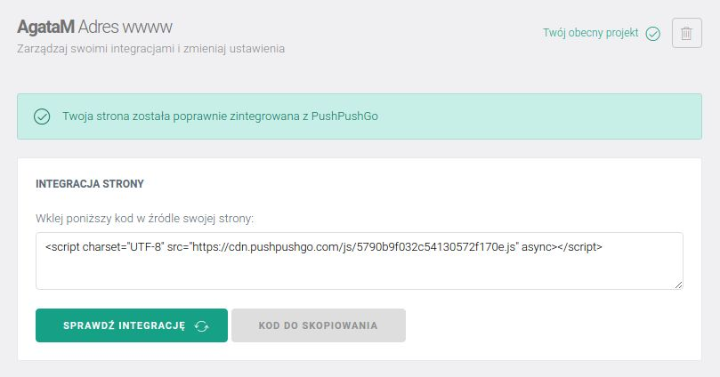
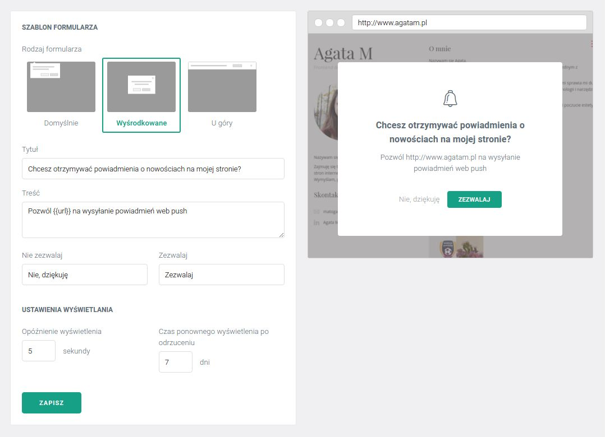
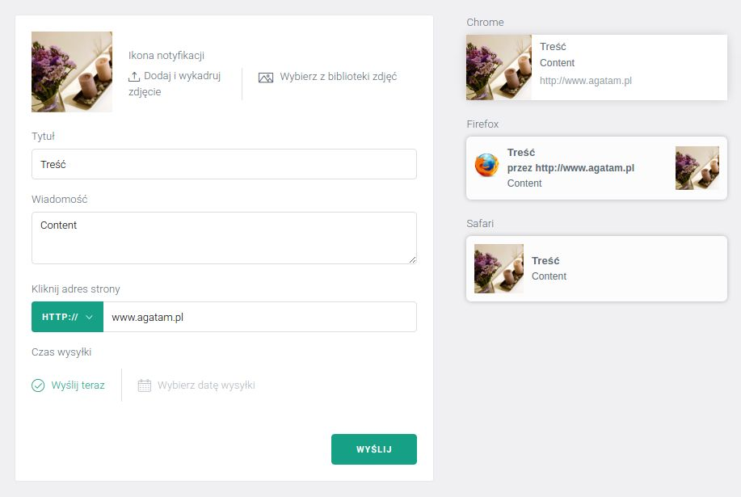

Powiadomienia push to niezwykle proste narzędzie do komunikacji z użytkownikami strony bądź serwisu WWW.
Ta stosunkowo *nowa technologia* dopiero wkracza na rynek, dlatego wiedza na jej temat bywa bardzo enigmatyczna.

Aby przybliżyć zagadnienie powiadomień web push, postanowiliśmy opisać ich działanie oraz przeprowadzić przez pierwsze kroki w naszej aplikacji:
- Stworzenie projektu
- Zintegrowanie strony
- Skonfigurowanie formularza zapisu
- Wysyłka pierwszej kampanii

### Zintegruj swoją stronę WWW

Pierwszym krokiem po założeniu konta w aplikacji PushPushGo jest stworzenie projektu, który będzie zawierał dane odnośnie naszej strony WWW.

Po utworzeniu projektu zostaniemy przeniesieni w zakładkę z jego ustawieniami. Z początku wyświetlony zostanie komunikat o błędnej integracji strony.
Wystarczy jednak *skopiować wskazaną linię kodu* i wkleić ją do kodu źródłowego strony, na której wysyłane będą powiadomienia.

Ta prosta czynność, to cały proces integracji. Po wklejeniu kodu, można sprawdzić status klikając
przycisk „Sprawdź integrację”. Jeśli proces przebiegł pomyślnie, komunikat poinformuje, że strona
została *poprawnie zintegrowana*.

Już teraz, po wejściu na Twoją stronę będzie można zaobserwować,
że przy pasku url wyświetla się dymek z zapytaniem o akceptację powiadomień web push.

### Dostosuj wygląd formularza zapisu

Wyświetlający się domyślny dymek, nazywany również formularzem zapisu, jest edytowalny z
poziomu aplikacji. W zakładce „Szablony” dostępne są różne layouty, które odpowiadają za sposób
jego wyświetlania.

Warto także zredagować tekst formularza, by *zachęcił użytkowników do kliknięcia*
w przycisk „Akceptuj”.

Dodatkowo, w tej samej zakładce, można skonfigurować czas po jakim formularz się wyświetli oraz
czas po jakim formularz pojawi się ponownie, po odrzuceniu powiadomień przez użytkownika. Po
zapisie nowych ustawień formularza, rezultat można podejrzeć po odświeżeniu strony.

### Zapis odbiorców

Teraz, gdy strona jest już poprawnie zintegrowana, a skonfigurowany formularz zachęca do
subskrypcji, użytkownicy, którzy klikną przycisk „Akceptuj” automatycznie *zostaną zapisani w bazie
odbiorców*. Lista zapisanych użytkowników dostępna jest w aplikacji w zakładce „Odbiorcy”.

Każdy odbiorca jest oznaczony jednym z trzech statusów: „Zapisany”, „Wypisany” lub „Utracony”. Jak
nie trudno się domyślić, zaraz po zaakceptowaniu powiadomień, subskrybent otrzymuje status
„Zapisany”.

Zapis na powiadomienia może nastąpić *w danej przeglądarce na danym urządzeniu*. Jeśli użytkownik
posiada wiele urządzeń i na wszystkich chce otrzymywać powiadomienia, musi złożyć akceptację
osobno na każdym z nich. W tej sytuacji, w naszej aplikacji będą to osobni odbiorcy, mimo, że w
rzeczywistości jest to jedna osoba.

Status „Utracony” otrzymuje odbiorca, który odinstaluje
przeglądarkę i możliwość wysyłki powiadomień do niego przepada bezpowrotnie.

### Wysyłka kampanii

Mając w swojej bazie odbiorców, możemy zacząć wysyłać do nich pierwsze kampanie. Używając
powiadomień push można przekazywać im rozmaite informacje, przykładowo o *nowych treściach na
naszej stronie*, promocjach, aktualnościach czy jakichkolwiek zmianach.

Warto wykorzystać tutaj
kreatywność oraz znajomość użytkowników własnego serwisu i *dostosować treść kampanii* w taki
sposób, by przykuć ich uwagę.

Komunikat web push jest bardzo prosty. Może składać się z *obrazka, tytułu, treści oraz linka*.

Powiadomienia pojawiają się w rogu ekranu urządzenia, bez względu na to czy włączona jest
przeglądarka. *Wyświetlają się przez określony czas*, a następnie znikają. Jeśli użytkownik ma
wyłączone urządzenie powiadomienia będzie mógł zobaczyć zaraz po jego uruchomieniu.

Więcej o wyglądzie i wsparciu powiadomień push możesz przeczytać w [następnym artkule](../push-support/).

