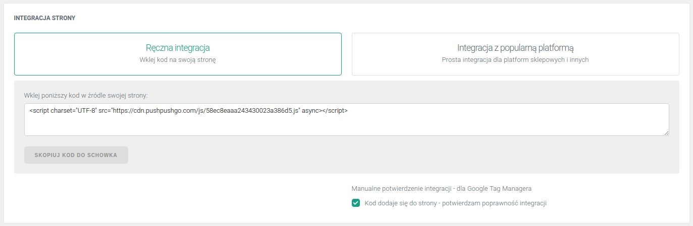
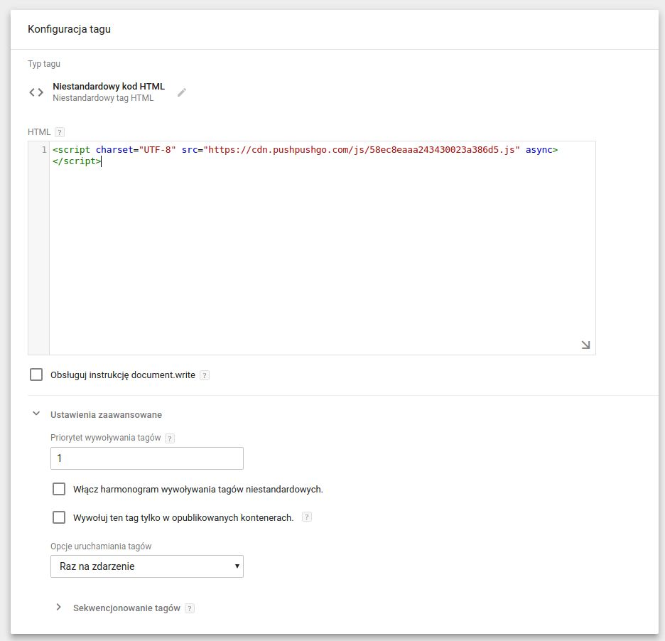
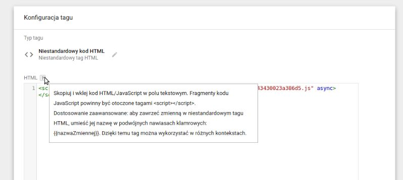
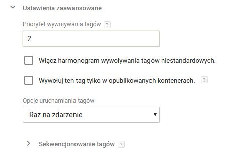

Chcemy, aby proces integracji strony www czy sklepu internetowego z PushPushGo był dla Ciebie jak najwygodniejszy.

Jeżeli zależy Ci na czasie lub nie chcesz być uzależniony przy każdej zmianie w źródle strony od programisty, możesz również skorzystać z naszej integracji poprzez Google Tag Managera.

Postępuj zgodnie z poniższymi wskazówkami a proces integracji nie zajmie Ci więcej niż 5 minut!

- 1. Najpierw załóż nowe konto na platformie PushPushGo i kliknij przycisk *Ręczna integracja*, aby wygenerować indywidualny skrypt integracyjny dla Twojej strony www lub serwisu.

- 2. Skopiuj skrypt integracyjny do schowka i zaznacz checkbox *Manualne potwierdzenie integracji - dla Google Tag Managera*.

3. Na swoim koncie w GTM utwórz nowy tag *Niestandardowy kod html* i wklej skopiowany skrypt integracyjny.

4. Otwórz *Ustawienia zaawansowane* i w polu *Priorytet wywoływania tagów* ustaw 1.

5. Następnie wybierz regułę wyświetlania.
6. Nazwij tag, np. *PushPushGo - skrypt integracyjny* i zapisz go.

Tagowanie subskrybentów na podstawie zainteresowań

Na platformie PushPushGo możesz również tagować subskrybentów np. na podstawie podstron, które przeglądali w Twoim serwisie.

Tagowanie możesz ustawić [z poziomu platformy PushPushGo](https://edu.pushpushgo.com/pl/poradnik/tagowanie) lub skorzystaj z poniższej części instrukcji.

7. Dodaj kolejny tag *Niestandardowy kod html* i wklej w nim poniższy skrypt:

<var id="ppg-tags" data-tags="TAGS_LIST"></var>

8. Następnie podmień w nim parametr TAGS_LIST na swoje zmienne, na podstawie poniższej instrukcji.

 
9. Otwórz *Ustawienia zaawansowane* i w polu *Priorytet wywoływania tagów* ustaw 2.

 

10.  Następnie wybierz regułę wyświetlania.
11. Nazwij drugi tag, np. *PushPushGo - tagi* i zapisz.
12. Na koniec nie zapomnij opublikować zmian.

Twoja integracja jest już gotowa!

