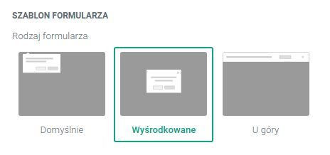
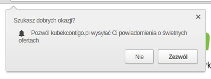
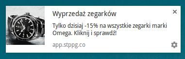

Notyfikacje web push zdobyły już miano skutecznego narzędzia marketingowego, które w *szybkim tempie generuje ruch* a jednocześnie zwiększa sprzedaż w ecommerce.

Trudno o równie angażujące uwagę odbiorcy rozwiązanie, dlatego też Klienci PushPushGo, którzy na bieżąco optymalizują swoje kampanie mogą pochwalić się m.in. *ponad 50% wskaźnikiem kliknięć swoich wysyłek*.

Co zrobić, aby uzyskać równie imponujące wyniki?

W tym poradniku znajdziesz *4 wskazówki*, dzięki którym zmaksymalizujesz skuteczność swoich notyfikacji web push, wykorzystując w pełni ich marketingowy potencjał i nie tracąc przy tym zbyt wiele czasu.

## 1. Dopracuj do perfekcji swój formularz zapisu

Formularz zapisu na Twoje powiadomienia web push to główne narzędzie, które zapewni powodzenie Twoim wysyłkom. O ile starannie go przygotujesz, zaowocuje szybkim przyrostem odbiorców, którzy chcą otrzymywać od Ciebie rabaty i dedykowane oferty.

### Użyj odpowiedniego języka

Tworząc własny formularz zapisu masz do dyspozycji, aż trzy sposoby wyświetlania go na stronie Twojego sklepu, może to być:

- *okienko pop-up* na środku strony,
- *pozioma belka* u góru strony,
- *prostokątne okienko* w lewym górnym rogu ekranu.

Niestety nawet najlepiej dostosowany do wyglądu sklepu formularz będzie odstraszał subskrybentów, jeśli np. nie dostosujesz jego języka do języka odbiorców.

Pamiętaj, że domyślnym językiem powiadomień, które obsługują przeglądarki internetowe jest angielski.

Jeśli nie zmienisz komunikatów, np. “Allow”, “Block” nie wszyscy z Twoich odbiorców zrozumieją w jakim celu mają kliknąć wyświetlający się dymek. Co więcej, obcojęzyczny element strony Twojego sklepu nie wzbudzi ich zaufania.

***
Skuteczny formularz zapisu na notyfikacje web push:

***
- Zawiera *treści w języku, dostosowanym do odbiorców* - pamiętaj, że możesz na jednym koncie w PushPushGo stworzyć kilka projektów w różnych językach,
- Zawiera jasny przekaz w języku korzyści - bezpośrednio informuje, *co odbiorca będzie miał z tego*, że zapisze się na subskrypcję, np. dostęp do ofert tylko dla subskrybentów,

## 2. Przygotuj odpowiednią treść notyfikacji web push

Notyfikację web push możesz dowolnie spersonalizować wybierając *tytuł oraz krótką treść*, tak aby Twój odbiorca mógł go przeczytać za jednym spojrzeniem i odruchowo kliknąć w link.

Aby zwiększyć skuteczność komunikatu zawrzyj w nim jasny przekaz, *w postaci korzyści* jaką klient osiągnie klikając w link, np. dostęp do promocyjnej oferty.

### Wykorzystaj grafikę

Pamiętaj, że obrazy są przetwarzane [60 tys. razy szybciej](https://magic.piktochart.com/embed/5359553-why-infographics) niż tekst, dlatego idealnym uzupełnieniem tekstu notyfikacji będzie, np. zdjęcie komunikowanego produktu.

***
Skuteczny komunikat web push zawiera:

***
- Czytelne wezwanie do działania jak *“kliknij”*, *“wejdź”* - pamiętaj, że web push to nowy format marketingowy, nie każdy z odbiorców wie, że wyświetlony dymek należy kliknąć, co może wpływać na wskaźniki Twoich kampanii,
- Atrakcyjne *zdjęcie produktu*, które przyciągnie uwagę odbiorcy,
- Docelowy link, który poprowadzi odbiorcę bezpośrednio na *stronę oferowanego produktu*. Jeśli klient będzie zmuszony szukać promocyjnej oferty na stronie, najprawdopodobniej tego nie zrobi,
- W przypadku ofert cenowych, dobrze jest *ograniczyć je w czasie*, zwiększysz w ten sposób wrażenie pilności i szansę, że klient dokona zakupu od razu po wejściu na stronę.

## 3. Wybierz odpowiednich odbiorców kampanii web push

W panelu PushPushGo samodzielnie wybierzesz czy dany komunikaty wysłać *do wszystkich odbiorców* czy tylko do grupy, wybranej np. na podstawie przeglądniętych lub ostatnio zakupionych produktów.

Oczywiście w przypadku produktów sezonowych, które chcesz jak najszybciej wyprzedać możesz przesłać kampanię do całej bazy odbiorców.

Taka strategia jest jednak mniej skuteczna i powoduje duże ryzyko, iż nie trafisz w upodobania klienta. Przede wszystkim pamiętaj o podstawowym targetowaniu po płci, tak aby nie wysyłać np. oferty męskiej odzieży swoim klientkom.

Tag oznaczający płeć odbiorcy możesz samodzielnie dodać w zakładce Odbiorcy.

***
Podczas targetowania kampanii web push:

***
- Zastanów się, których odbiorców *najbardziej zainteresuje produkt* - może to być asortyment, który już kiedyś kupiono, jednak z pewnym odstępem czasu lub *produkt komplementarny* do wcześniej nabytego, np. łańcuszek i pierścionek do kompletu.

## 4. Wybierz najlepszy czas wysyłki

Notyfikacje web push docierają do Twoich odbiorców praktycznie w czasie rzeczywistym a stworzenie każdej z nich zajmuje tylko klika minut. To sprawia, że pokusa zalewania odbiorców wieloma komunikatami jest dosyć duża.

Pamiętaj, że tak jak w przypadku email marketingu, zbyt duża ilość wiadomości jest *głównym powodem wypisu z subskrypcji* powiadomień web push.

O ile ogólne komunikaty, np. informujące o nowej dostawie konkretnych produktów nie będą dla odbiorców tak uciążliwe, tak wysyłanie kilka razy dziennie rabatu na różny towar może spowodować, że odbiorcy przestaną chcieć otrzymywać Twoje powiadomienia.

Ważny jest też rodzaj informacji, które wysyłasz - jeśli prowadzisz bloga lub możesz podzielić się z klientami jakimiś treściami edukacyjnymi, *oddzielaj nimi swoją komunikację sprzedażową*.

Zwłaszcza w przypadku ecommerce kluczową rolę odgrywa odpowiedni czas wysyłki web push. Jeśli chodzi o treści typowo informacyjne, które mają tylko zbudować wizerunek sklepu możesz je wysyłać przez cały czas.

W przypadku komunikatów sprzedażowych pamiętaj, że notyfikacja web push po kilku sekundach znika a jest naprawdę mała szansa, że Twój klient dokona zakupu w trakcie pracy. Dlatego w tym przypadku *lepiej sprawdzają się godziny popołudniowe i wieczorne*.

***
Podczas wysyłki kampanii web push:

***
- Uwzględnij zajęcia odbiorców, w poszczególnych porach dnia, młode mamy będą gotowe do zakupu przez cały dzień, jednak osoby pracujące zapomną o Twojej ofercie do wieczora,
- Pamiętaj, aby monitorować czy nie wysyłasz kampanii zbyt często a subskrybenci nie wypisują się przez to z bazy.

Na zakończenie, pamiętaj, że to Ty najlepiej znasz swoich odbiorców a nasze wskazówki mają Ci jedynie wskazać, jakie strategie okazują się najskuteczniejsze w przypadku większości naszych Klientów.

Najlepsze co możesz zrobić, aby zwiększyć skuteczność swoich działań marketingowych to stale monitorować swoje wskaźniki i reakcje Klientów. Życzymy powodzenia i zapraszamy do czytania naszych pozostałych poradników!

