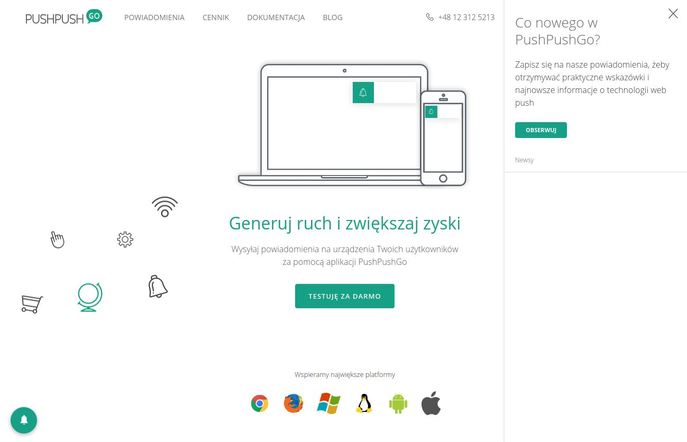
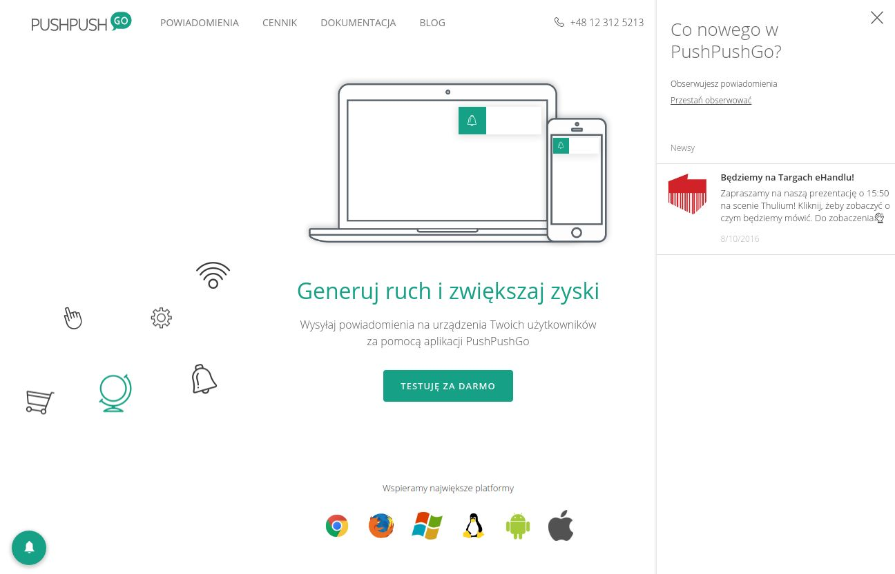
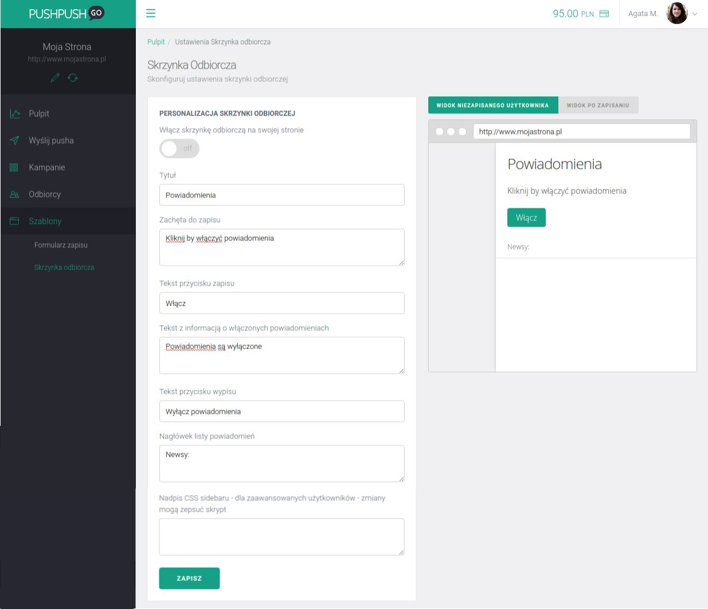
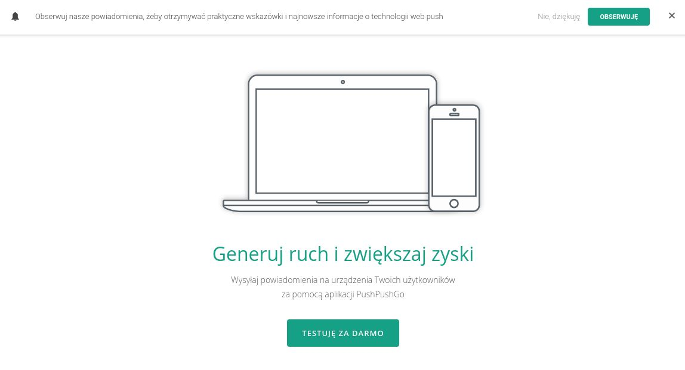

Analizy działań email marketingowych wykazują, że wielu odbiorców po pierwszym otwarciu newslettera kilka razy powraca do skrzynki odbiorczej by przypomnieć sobie jego treść lub skorzystać z przesłanego kodu rabatowego.

Mechanizm działania notyfikacji web push jest bardzo zbliżony do email marketingu, dlatego postanowiliśmy udostępnić naszym klientom analogiczne rozwiązanie na stronie internetowej, aby zwiększyć skuteczność ich działań.

Przetestuj skrzynkę odbiorczą dla powiadomień web push na swojej stronie i daj swoim odbiorcom możliwość powrotu do otrzymanych wcześniej powiadomień.

### Zastosowania skrzynki odbiorczej web push

Skrzynka odbiorcza wzbogaca narzędzie jakim jest web push o nowe możliwości:

- dajesz swoim odbiorcom możliwość powrotu do treści powiadomienia, w dowolnym momencie, bez spamu i rozpraszaczy w postaci konkurencyjnych ofert,
- masz pewność, że klient sam wybierze najlepszy dla niego moment na skorzystanie z kodu rabatowego,
- skrzynka odbiorcza to interaktywny element Twojej strony, który skłoni klienta do zapisu na powiadomienia.

### Jak działa skrzynka odbiorcza web push

Po włączeniu komponentu, w lewym dolnym rogu na stronie pojawi się okrągły button z dzwoneczkiem, służącym do otwierania skrzynki odbiorczej.

Panel ze skrzynką różni się treścią w zależności od tego, czy użytkownik jest zapisany na powiadomienia czy nie.

Dla niezapisanych użytkowników wyświetlany jest tekst i button zachęcający do zapisu.

Natomiast aktywni subskrybenci widzą informację o tym, że są zapisani, link rezygnacji oraz historię otrzymanych powiadomień.

### Jak włączyć skrzynkę na swojej stronie

Włączyć skrzynkę możesz w zakładce Szablony > Skrzynka odbiorcza. Zobacz jak to zrobić krok po koku [w naszym poradniku](../../../pages/documentation/#inbox_sidebar).

Przed włączeniem komponentu warto przetłumaczyć i dostosować teksty, tak by zachęcały do zapisu na powiadomienia. Jest to także dodatkowa przestrzeń, w której możesz rozwinąć informacje z formularza zapisu.

Poinformuj odbiorców:

- jak często będziesz wysyłać powiadomienia,
- jakimi informacjami będziesz się z nimi dzielić,
- jakie korzyści wynikają z zapisu na Twoje powiadomienia.

