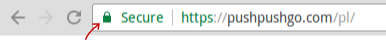
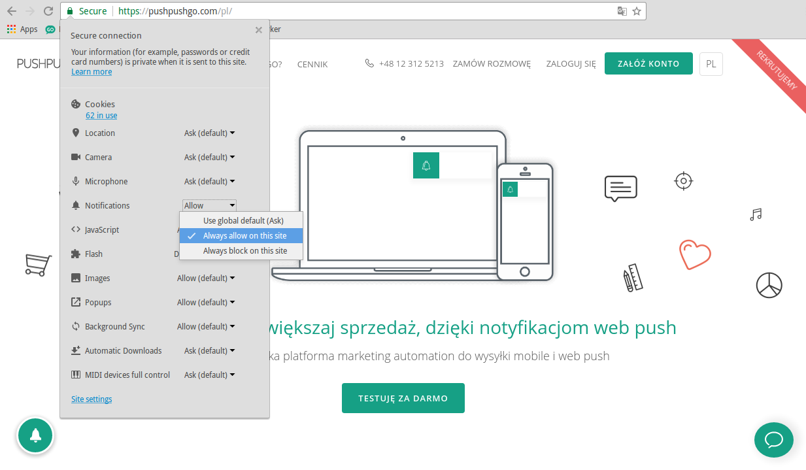

Aby włączyć powiadomienia web push na konkretnej stronie, należy będąc na tej stronie kliknąć w ikonkę, która znajduje się w pasku przegądarki, przed adresem URL:

Ikonka na stronie z HTTPS:

Ikonka na stronie HTTPS:

Po kliknięciu w ikonę, pokaże nam się panel z ustawieniami przeglądarki, takimi jak zgoda na geolokalizację, dostęp kamery i mikrofonu i tym podobne.
Co najważniejsze, możemy tam właśnie ustawić pozwolenie na otrzymywanie powiadomień web push z danej domeny.

Wyszukujemy na liście ustawień pozycji *"Notifications"* lub "Powiadomienia" i wybieramy opcję *"Always allow on this site"* lub jeśli mamy ustawiony język przeglądarki na polski - "Zezwalaj".

Od tej pory będziesz otrzymywać powiadomienia z tej domeny :)

