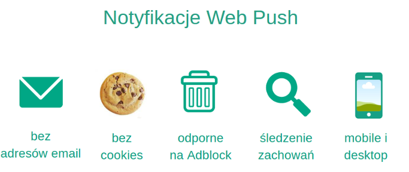
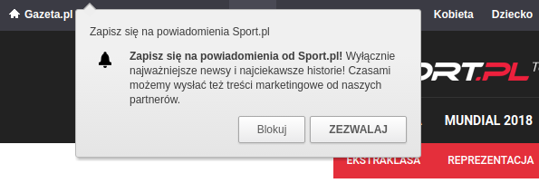
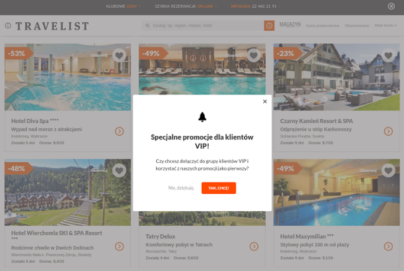
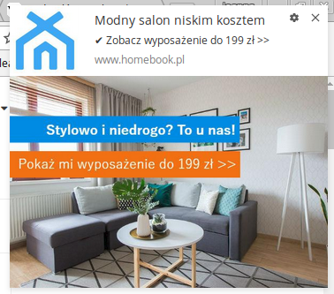
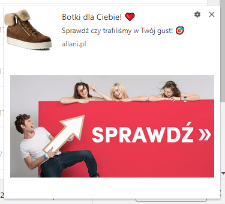

Notyfikacje web push to nowy gracz wśród kanałów online. Mimo to, szybko stały się istotnym elementem marketing mix wielu firm na świecie. Już pod koniec 2017 roku, wszystkie zespoły odpowiedzialne za rozwój przeglądarek internetowych (RFC) potwierdziły, iż powiadomienia będą wspierane przez obecne i kolejne wersje każdej z nich.

Oznacza to, że przed marketerami otwiera się zupełnie nowy kanał dotarcia do (jak szacuje NetMarketShare) **ponad 80% użytkowników internetu**. Z tego artykułu dowiesz się jak wykorzystywać notyfikacje web push na 5 praktycznych przykładach, do wdrożenia w każdej firmie.

## 1. Budowanie bazy subskrybentów, którzy ignorują newslettery

Jak wskazuje raport [2017 Email Signup Benchmarks](https://sumo.com/stories/email-signup-benchmarks), opublikowany przez Sumo, średni wskaźnik zapisów na newsletter wynosi **1,95%**. Tylko 10% najlepszych email marketerów uzyskuje wynik na poziomie **4,77%**.

Dla porównania, badanie przeprowadzone wśród Klientów PushPushGo pokazuje, iż wskaźnik zapisów na powiadomienia web push wynosi średnio **od 5 do 10%**. Skąd ta różnica?

Web push to przede wszystkim zupełnie nowy kanał marketingowy. Gdy wielu internautom newsletter kojarzy się często **ze spamem lub nachalnymi treściami sprzedażowymi**, notyfikacje nie zdążyły jeszcze zbudować złej renomy.

Sam zapis odbywa się za pomocą jednego kliknięcia, bez potrzeby wpisywania jakichkolwiek danych, co ma przełożenie na wyższą konwersję.

**Praktyczny przykład**

Własna baza web push jest dla Ciebie szansą na zdobycie zainteresowania osób, które obawiają się spamu lub zwyczajnie nie chcą zaśmiecać swojej skrzynki mailowej newsletterami. Powiadomienia pokazują się, po czym zamknięte lub kliknięte, **znikają nie wymagając żadnej akcji ze strony subskrybenta** (np. wyrzucenia maila do kosza).

Żeby przekonać odwiedzających stronę do subskrypcji Twoich powiadomień, przede wszystkim postaraj się zdobyć ich zaufanie do tego nowego kanału komunikacji. Informuj wprost, używając języka korzyści, jakie treści i jak często zamierzasz im wysyłać, czego mogą się spodziewać.

*Formularz zapisu web push, Sport.pl*

Kolejną skuteczną zachętą do zapisu na Twoje powiadomienia jest oferowanie w zamian dostępu do ekskluzywnych treści lub ofert specjalnych, dostępnych tylko dla subskrybentów.

*Formularz zapisu web push, Travelist*

Gdy zbudujesz już własną bazę web push, możesz ją wykorzystać w przypadku **edukacji klientów**, a także **wygrzewania leadów**. Tworząc własne ścieżki web push automation, zaplanujesz wysyłkę w odpowiednim czasie (np. od razu po zapisie i 3 dni po nim) lub stworzysz całe cykle komunikacji.

To dobra okazja, aby przemycić informacje, które zbudują w oczach odbiorców mocniejszy wizerunek Twojej marki - wykorzystaj do tego np. opinie Twoich dotychczasowych klientów czy case study.

Aby szybciej „przesuwać” subskrybentów w dół lejka sprzedażowego, możesz umieszczać  w notyfikacjach treści edukacyjne. Ułatwią odbiorcom podejmowanie przyszłych decyzji (wykorzystaj np. poradnik kupującego) i skłonią je do pierwszego zakupu.

## 2. Zwiększenie powracalności na Twoją stronę www

W jaki sposób monitorujesz, którzy z odwiedzających Twoją stronę wrócili na nią w ostatnich kilku dniach czy miesiącach? Co robisz, aby ponownie przyciągnąć ich uwagę? Czy Twój **RVR** (return visitor rate) utrzymuje się na satysfakcjonującym poziomie?

**Analizę kohortową**, którą prowadzisz na swojej stronie www, możesz również wspomóc śledzeniem zachowań użytkowników. Dzięki integracji z platformą web push możesz automatycznie monitorować, którzy z nich nie odwiedzili strony np. w ciągu ostatniego miesiąca i wcześniej przygotować notyfikację, która zostanie im wtedy automatycznie wysłana.

**Praktyczny przykład**

Załóżmy, że dany subskrybent web push nie pojawił się na Twojej stronie www od 30 dni. Możliwe, że zainteresował się ofertą konkurencji lub po prostu zapomniał o Twojej marce. Oczywiście, Twoim celem jest ponowne przyciągnięcie jego uwagi.

Wystarczy, że ustawisz odpowiedni scenariusz web push automation, dzięki któremu system automatycznie wykryje, który z odbiorców nie pojawiał się ostatnio na stronie i wyśle do niego wcześniej przygotowaną notyfikację.

Aby zwiększyć skuteczność przekazu możesz odnieść się w notyfikacji do:

- **ostatnio przeglądanych produktów**, np. sandały na obcasie w cenie 99 zł,
- **adresu url**, który wyświetlił na stronie jako ostatni np. case study,
- **ostatnio przeglądanej kategorii produktów w danej cenie**, np. meble do salonu w poniżej 199 zł.

*Powiadomienie web push, Homebook*

Sam ustalisz, czy chcesz później na tej podstawie podzielić subskrybentów na lojalnych i nielojalnych, np. na podstawie tego jak często odwiedzają Twój sklep. Do każdej z tych grup możesz wysłać kampanię, która będzie miała na celu jej aktywizację lub podziękowanie za lojalność, np. w formie przesłanego rabatu.

## 3. Optymalizacja konwersji i porzucone koszyki

Międzynarodowa agencja badawcza Baymard Institute, co roku publikuje statystyki porzuconych koszyków, zebrane z różnych źródeł z całego świata. Obecnie szacuje się, że ponad [69% koszyków jest porzucanych przez klientów ecommerce](https://baymard.com/lists/cart-abandonment-rate).

Trudno znaleźć równie obiektywne informacje, jeśli chodzi o inne rodzaje konwersji, które odbywają się na Twojej stronie www. Ile osób wypełnia np. formularz zgłoszeniowy na webinarium, tylko do połowy? Lub chciał zawnioskować o kredyt, ale finalnie nie podał wszystkich danych i odszedł od komputera?

Dzięki web push automation możesz dotrzeć do tych osób w dowolnym czasie od momentu, gdy opuściły Twoją stronę, nawet gdy odbiorca przegląda już stronę konkurencji. Automatycznie wysłana notyfikacja i tak wyświetli się w rogu ekranu jego komputera lub urządzenia mobilnego.

**Praktyczny przykład**

System web push na bieżąco monitoruje, którzy subskrybenci porzucają swoje koszyki lub formularze. Weryfikuje również jaką wartość miał koszyk i czy takie „porzucenie” ma miejsce po raz pierwszy czy jest notorycznie powtarzane, aby otrzymać np. dodatkową zniżkę.

Możesz więc zaplanować kilka różnych notyfikacji, które otrzymają odbiorcy w zależności od wartości koszyka lub czasu jaki minął od przerwania transakcji. Osoby, które próbują „wyłudzić” taki nieplanowany rabat możesz oznaczyć w swojej bazie jako „regularnie porzucające” i np. nie oferować im zniżek w przyszłości.

*Notyfikacja web push, Virtualo*

## 4. Jeszcze lepsza obsługa klienta

**Przyciski akcji** dają możliwość umieszczenia dwóch alternatywnych linków w jednej notyfikacji web push. Oznacza to, że w zależności od tego, który przycisk kliknie odbiorca, zostanie przekierowany na odpowiednią stronę docelową.

Umieszczając w notyfikacji dwa przyciski zwiększasz też szansę na kliknięcie. Widząc dwie opcje, odbiorca nie zastanawia się nad tym czy kliknąć w notyfikację tylko bardziej, która z wyświetlonych opcji jest mu bliższa.

**Praktyczny przykład**

Żeby na bieżąco monitorować czy świadczony przez Ciebie poziom obsługi jest satysfakcjonujący dla klientów możesz skorzystać z automatycznej wysyłki po wykonanej transakcji.

Taka notyfikacja, wysłana np. po 5 dniach od zakupu, może zawierać dwie przykładowe opcje oceny:

- **„Wszystko w porządku”** - przycisk kieruje na landing page z podziękowaniem za odpowiedź,
- **„Mam zastrzeżenia”** - przycisk kieruje do ankiety po zakupie, której celem będzie zweryfikowanie co poszło nie tak.

W ten sposób szybko zidentyfikujesz powody niezadowolenia swoich klientów i zyskasz szansę, aby naprawić złe wrażenie, które może skutkować odpływem klientów do konkurencji.

*Notyfikacja web push z przyciskami akcji, Strefa Kursów*

## 5. Śledzenie zainteresowań odbiorców

Własna baza subskrybentów web push jest równie cennym aktywem jak klasyczna baza newsletterowa. Gromadzi ona osoby, które były na tyle zainteresowane produktami lub usługami Twojej firmy, że chcą otrzymywać o nich informacje także w przyszłości.

To oczywiste, jednak czy masz pewność, że treści którymi dzielisz się z subskrybentami zawsze odpowiadają ich zainteresowaniom? W przypadku web push możesz łatwo rozwiązać ten problem, ponieważ wszystkie zachowania odbiorców są monitorowane, co ułatwia potem segmentację bazy ze względu na to czego szukali na stronie lub jakie artykuły do tej pory czytali.

**Praktyczny przykład**

Zanim zaczniesz wysyłać własne kampanie web push zadbaj o to, aby platforma mogła automatycznie zbierać informacje o tym jakie produkty lub kategorie wyświetlali konkretni subskrybenci.

Dzięki temu każda osoba, która przynajmniej raz wyświetliła np. kartę produktową butów trekkingowych będzie miała przypisany tag, buty trekkingowe. W identyczny sposób posegmentujesz bazę na podstawie wyświetlanych adresów url, np. strony cennika czy wykonanych akcji, np. zakupu danej usługi.

*Notyfikacja web push, Allani*

Masz wątpliwości czy powiadomienia web push sprawdzą się w Twojej firmie? Pamiętaj, że podczas bezpłatnego okresu testowego stworzymy dla Ciebie dedykowaną strategię web push i sprawnie przeprowadzimy Cię przez proces wdrożenia.

Uważamy, że nie istnieje coś takiego jak głupie pytanie :) Chętnie odpowiemy na wszystkie z nich, jesteśmy do Twojej dyspozycji na chacie, pod mailem oraz telefonem. Do usłyszenia!
