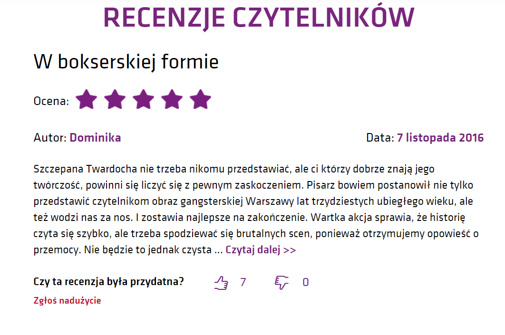
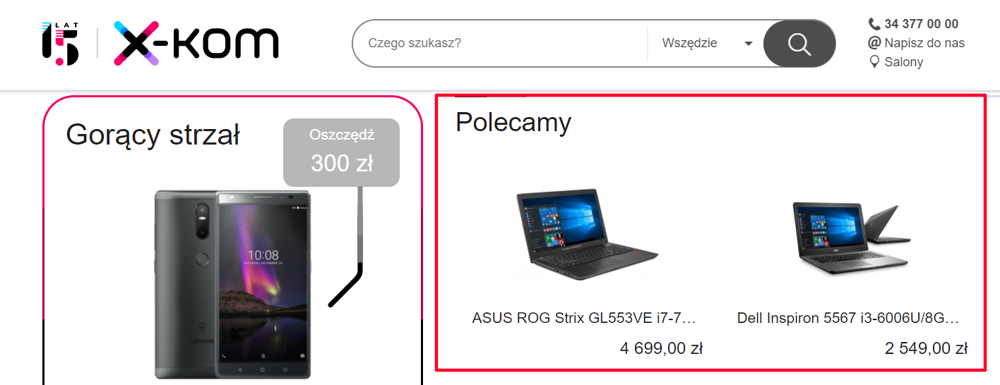
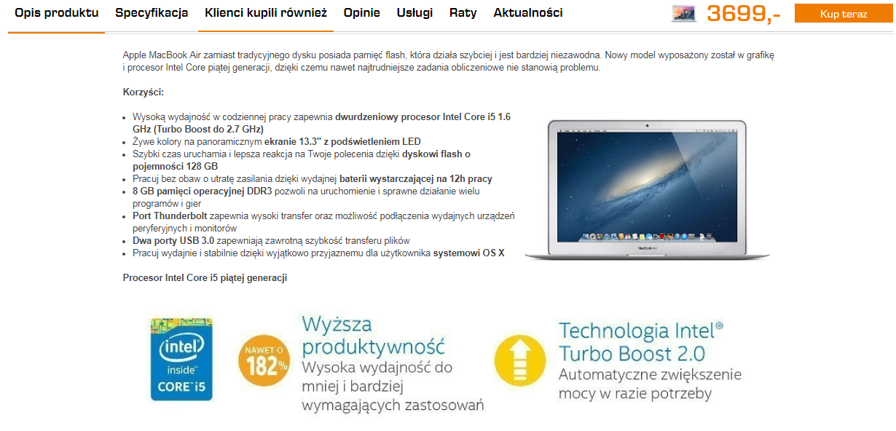
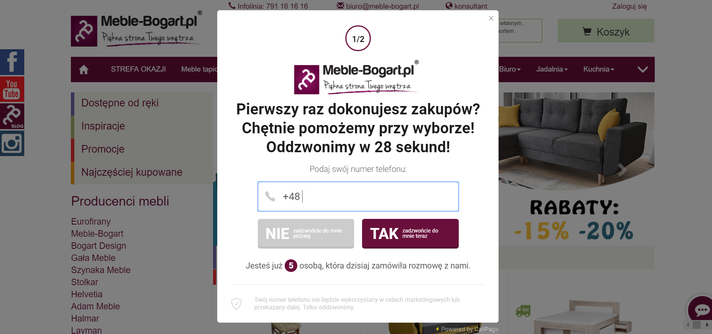

Rozwijanie sklepu internetowego oznacza ciągłe wyzwania. Chociaż <a href="https://www.gemius.pl/wszystkie-artykuly-aktualnosci/najnowsze-dane-o-polskim-e-commerce-juz-dostepne.html" target="_blank">53% polskich internautów</a> (czyli ponad 13 milinów osób) kupuje w polskich e-sklepach, to ponad <a href="http://superbiz.se.pl/opinie-biz/40-mld-zl-tyle-warty-jest-handel-internetowy-w-polsce_939619.html" target="_blank">80% sklepów internetowych</a> kończy działalność po 2-3 latach. Co więcej, <a href="https://searchengineland.com/7-conversion-rate-truths-will-change-landing-page-optimization-strategy-191083" target="_blank">średni współczynnik konwersji w e-commerce plasuje się między 1-2%</a>, a według różnych  źródeł ok.*90%* użytkowników nie wykonuje żadnej akcji, kiedy trafia na daną stronę internetową. Dlatego jednym z podstawowych wyzwań branży e-commerce jest więc utrzymanie się na rynku i zachęcenie klienta do zakupu - co wcale nie łatwe.

Żeby ułatwić Ci życie, pokażę **kilka niezawodnych sposobów**, które pomogą zachęcić klienta do zakupu. Skuteczność gwarantowana!

> Ten post jest wpisem gościnnym autorstwa Magdaleny Wąsowicz, Content Managera w CallPage
>
> **Dowiesz się z niego:**
> - jakie triki psychologiczne wykorzystać, by zachęcić klienta do zakupu
> - jak wykorzystać recenzje do zwiększenia sprzedaży
> - jak zasada niedostępności i kontrastu pomoże Ci sprzedać
> - jak używać języka korzyści
> - dlaczego warto zachęcić klienta do kontaktu z firmą

## 1. Wykorzystaj społeczny dowód słuszności
Jednym z najbardziej skutecznych trików na przekonanie klienta do zakupu produktu, jest wykorzystanie społecznego **dowodu słuszności**. Zasada ta mówi, że ludzie, którzy nie wiedzą, co zrobić, podejmują decyzję na podstawie tego, jak zachowują się inni.

**Co to oznacza w praktyce?**

Jeśli klient ma do wyboru dwa komputery, to najprawdopodobniej wybierze ten, który poleci mu znajomy lub ten, który zostanie **pozytywnie zrecenzowany** przez eksperta lub influencera. <a target="_blank" href="https://www.callpage.pl/blog/12-elementow-stron-firmowych-ktore-wzbudzaja-zaufanie-klientow">Opinie innych</a> konsumentów mają ogromny wpływ na decyzje zakupowe. Większość z nas prędzej uwierzy, że dany produkt warto kupić, gdy wie, że spodobał się też innym. Pewnie nie raz zdarzyło Ci się kupić książkę dlatego, że znajdowała się na półce z bestsellerami albo wziąć do koszyka jakiś kosmetyk, ponieważ zobaczyłeś na nim naklejkę z hasłem “produkt roku”. Podświadomie uznałeś, że skoro pozostali klienci kupują ten produkt, to z pewnością jest on lepszy od innych.

Społeczny dowód słuszności można łatwo wykorzystać do zwiększenia sprzedaży. Wystarczy utworzyć na stronie internetowej sklepu **sekcję z najchętniej kupowanymi produktami** albo w widocznym miejscu umieścić recenzje i rekomendacje konsumentów.

Tak robi np. księgarnia Matras, która na głównej stronie ma sekcję “Bestsellery”, a dodatkowo niemal każda publikacja zawiera sekcję “Recenzje czytelników”, którą mogą sugerować się potencjalni kupujący:

</img>

*źródło: www.matras.pl*

Możesz też w czasie rozmowy z potencjalnym klientem zaznaczyć, że dany produkt jest bestsellerem i cieszy się ogromnym powodzeniem wśród innych kupujących. Jeśli Ty z niego korzystałeś, to możesz też powiedzieć, że jesteś bardzo zadowolony z zakupu i że faktycznie spełnia on obietnice producenta. Zobaczysz, że zrobi to różnicę.

## 2. Zastosuj zasadę niedostępności

To, co trudno jest dostać, **wzbudza zainteresowanie**. Jak większość z ludzi podświadomie zakładasz, że jeśli coś jest trudno dostępne, to ma wysoką wartość. Nie mogąc w danej chwili mieć jakiejś rzeczy, zaczynasz o niej obsesyjnie myśleć. Efekt? Jak tylko pojawi się w Twoim zasięgu, to natychmiast ją kupujesz.

Reguła niedostępności działa najsilniej wtedy, kiedy o daną rzecz musisz rywalizować z innymi i gdy zjawisko niedostępności jest stosunkowo nowe (ludziom bardziej zależy na tym, co jest trudno dostępne od niedawna, a nie od zawsze).

Jak więc widzisz, to nie przypadek, że producenci wypuszczają na rynek **limitowane kolekcje** albo **ograniczają ofertę w czasie**.

**Jak możesz wykorzystać zasadę niedostępności w praktyce?**

To proste. Zaznacz na swojej stronie internetowej albo w czasie rozmowy z klientem, że oferta obowiązuje przez dany okres (np. “tylko dziś darmowa dostawa”, “zniżka 25% dla osób posiadających kartę stałego klienta”, “ostatni dzień wyprzedaży”) lub podkreśl ograniczenie ilości (“zostały już tylko 4 miejsca na wydarzenie”, “ostatnie sztuki”, “zostało już tylko 10 produktów w cenie promocyjnej).

Zobacz, jak robi to np. Orsay:

</img>

*źródło: www.orsay.com*

## 3. Stwórz kontrast

Zasada kontrastu polega na **pokazaniu jednego produktu przez pryzmat drugiego**. Dzięki niej możesz sprawić, że wybrany towar, na którego sprzedaniu ci zależy, będzie dla klienta bardziej atrakcyjny.

Wyobraź sobie, że idziesz do sklepu elektronicznego, żeby kupić drukarkę. Jeśli zobaczysz najpierw bardzo drogi sprzęt, a zaraz później nieco tańszy, to nawet jeśli znacznie przekracza on Twój budżet i tak wyda Ci się on przystępny cenowo. Stanie się tak właśnie dzięki zasadzie kontrastu. Zasada kontrastu dotyczy przede wszystkim jakości i cen towaru.

**Jak wykorzystać ją w praktyce?**

Gdy rozmawiasz z potencjalnym klientem, zaprezentuj mu najpierw jeden bardzo drogi produkt, a potem drugi, nieco tańszy - ten, na którego sprzedaży rzeczywiście Ci zależy. Nawet jeśli cena drugiego produktu będzie wysoka, to i tak wyda się on tani w porównaniu do pierwszego towaru. **Kolejność, w jakiej zaprezentujesz ofertę, jest tutaj kluczowa**.

Ten trik wykorzystuje na stronie głównej X-kom. Załóżmy, że chcesz kupić laptop. Wchodzisz na stronę główną sklepu internetowego, a tam jednym z pierwszych elementów, które widzisz jest sekcja “Polecane” i **zestawienie dwóch laptopów** - po lewej stronie ten droższy, po prawej tańszy (wzrok skanuje stronę od lewej do prawej, więc trafia najpierw na droższy produkt).

</img>

*źródło: www.x-kom.pl*

Zasada kontrastu ma jeszcze jedną zaletę: daje klientowi możliwość wyboru. A możliwość wyboru ma duży wpływ na podjęcie decyzji o zakupie. W artykule opublikowanym przez “Journal of Consumer Research” Daniel Mochon udowodnił, że klienci chętniej decydują się na zakup produktu, jeśli przedstawi się im kilka opcji. Dzieje się tak dlatego, że możliwość wyboru daje poczucie, że mamy kontrolę nad sytuacją i podejmujemy świadomą, racjonalną decyzję.

## 4. Wykorzystaj metodę “nie stać Cię na to”

Prędzej czy później w każdej rozmowie z klientem pojawią się obiekcje. Zwłaszcza jeśli klient od samego początku nie był przekonany do oferty, co przecież się zdarza, szczególnie jeśli dzwonisz do niego “na zimno”. W takiej sytuacji pokonywanie obiekcji może okazać się bardzo karkołomnym zadaniem, ale są na to sposoby. Jednym z nich jest wykorzystanie metody, którą można nazwać “nie stać Cię na to”. Polega ona na umieszczeniu oferty w jakimś szerszym kontekście i pokazanie rozmówcy, że **koszty, które poniesie** nie decydując się na zakup towaru lub usługi, będą znacznie **wyższe niż wtedy, kiedy je kupi**.

**Jak wygląda to w praktyce?**

Załóżmy, że przedstawiasz potencjalnemu klientowi ofertę kupna ubezpieczenia samochodu. Jeśli klient zaczyna przedstawiać obiekcje i twierdzi, że **cena oferty jest zbyt wysoka**, możesz mu powiedzieć, że jeśli zdarzy się jakiś wypadek, to koszty naprawy samochodu wielokrotnie przekroczą cenę ubezpieczenia.

Podobnie możesz zrobić w przypadku np. sprzętu elektronicznego. Jeśli klient stwierdzi, że komputer, który mu oferujesz, jest zbyt drogi, możesz mu powiedzieć, że chociaż sprzęt faktycznie dużo kosztuje, to **posłuży mu przez długie lata**, podczas gdy tańszy towar szybko się zepsuje i będzie wymagał wymiany, co w sumie będzie kosztowało znacznie więcej niż zakup produktu wyższej klasy.

## 5. Mów językiem korzyści

Częstym błędem popełnianym przez sprzedawców jest skupienie się na opisywaniu szczegółów technicznych produktu. Zazwyczaj są one zrozumiałe dla Ciebie, czyli osoby dobrze obeznanej z produktem, jednak niestety zwykłym ludziom niewiele mówią. **Zagłębianie się w dane techniczne może wręcz przestraszyć potencjalnego nabywcę.**

**Jak więc działać?**

Żeby skutecznie zachęcić klienta do zakupu, skup się nie na wyliczaniu parametrów technicznych, ale **na korzyściach, jakie te parametry zapewniają**. Tak więc w czasie rozmowy powinieneś najpierw zamienić cechę produktu w korzyść, a potem zobrazować tę korzyść. Krótko mówiąc - wytłumacz kupującemu, jak produkt może ulepszyć jego życie.

Przykładowo, oferując nowy model telefonu w którym aparat ma 13 Mpix, wytłumacz, że taka rozdzielczość zapewnia bardzo wysoką jakość zdjęć. Jeśli sprzedajesz oprogramowanie pomagające w zarządzaniu projektami, wyjaśnij, że dzięki oferowanym przez niego funkcjom łatwiej i szybciej można zorganizować pracę zespołu.

Zawsze przedstawiaj korzyści i **próbuj je obrazować** - w końcu klientów nie interesują tak naprawdę parametry techniczne produktu czy zawiłości prawne związane z daną ofertą, a to, jak proponowany towar może wpłynąć na ich życie. Oczywiście możesz to zrobić również na stronie e-sklepu. Wystarczy, że zadbasz o odpowiednie copy.

Przyjrzyj się np. opisowi komputera MacBook Air w którym wyjaśnione są korzyści wynikające z parametrów technicznych produktu:

</img>

*źródło: www.saturn.pl*

## 6. Skłoń odbiorcę do kontaktu z firmą

Większość klientów lubi zakupy przez internet, ponieważ są one wygodne, a towary często są tańsze niż w sklepie stacjonarnym. Jednak z punktu widzenia firmy, siłą tradycyjnego sklepu jest sprzedawca, który może pomóc klientowi, wybadać jego potrzeby, **udzielić informacji i zachęcić do zakupu**. W sklepie internetowym nie ma sprzedawcy - nie ma więc nikogo, kto mógłby zapobiegać porzucaniu koszyków.

Jest jednak na to sposób - wystarczy namówić osobę przeglądającą stronę internetową Twojego sklepu do **kontaktu z przedstawicielem firmy**. Możesz zrobić to umieszczając na stronie numer telefonu w widocznym miejscu, lub zaproponować **darmowy telefon zwrotny** np. za pośrednictwem widgetu CallPage.

</img>

<a target="_blank" href="https://www.callpage.pl/casestudy_callpage_meble_bogart">*źródło: Jak meble-bogart.pl zwiększyło jakość obsługi - case study*</a>

Gdy klient poda swój numer telefonu, widget automatycznie połączy go z przedstawicielem firmy, który będzie mógł odpowiedzieć na jego pytania i wykorzystać wiedzę do zachęcania go do zakupu.

## 7. Wskaż cechy, które sprawiają, że masz przewagę nad konkurencją

Internet daje możliwość szybkiego porównania Twojego produktu lub usługi z **ofertą konkurencji**. Możesz być niemal pewien, że zanim potencjalny klient podejmie decyzję o zakupie, to zrobi rozeznanie rynku. Warto o tym pamiętać i już w czasie rozmowy sprzedażowej odnieść się do tego, co oferują inni. Oczywiście trzeba **zrobić to z wyczuciem**. Oczernianie konkurencji nie sprawi, że klient chętniej kupi, wręcz przeciwnie, może go wręcz zniechęcić do transakcji. Dlatego zamiast mówić źle o konkurencji, wskaż cechy oferty, które sprawiają, że masz nad nią przewagę.

**Jak to zrobić?**

To proste - wskaż podstawowe różnice pomiędzy tym, **co oferujesz Ty, a co konkurencja**. Przykładowo atutem może być dłuższy okres gwarancji, lepsza funkcjonalność produktu, niższa cena, darmowa dostawa, wyższe oceny użytkowników itp. Naturalnie zanim się za to zabierzesz zrób dokładne rozeznanie u konkurencji. Klient najprawdopodobniej sprawdzi, czy faktycznie tylko ty oferujesz darmową dostawę.

Przedstawione powyżej triki to jedne z najbardziej skutecznych sposobów na zwiększenie sprzedaży i przekonanie klienta do zakupu. Koniecznie sprawdź, czy u Ciebie też zadziałają!

 
 

Autorka:

**Magdalena Wąsowicz**

*Content Marketing Manager w CallPage*.

Zajmuje się m.in. tworzeniem wpisów na bloga w języku polskim i angielskim, kontaktem z influencerami i dbaniem o jakość treści znajdujących się na stronie CallPage. Entuzjastka inbound marketingu, teatru muzycznego i włoskiej kuchni.

<a href="https://www.callpage.pl/" target="_blank">**CallPage**</a> - widget do zainstalowania na stronie internetowej e-sklepu, który umożliwia zamówienie rozmowy zwrotnej w 28 sekund i zamianę użytkowników strony w zadowolonych klientów.

