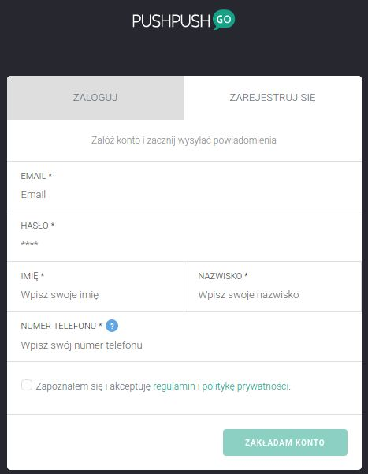
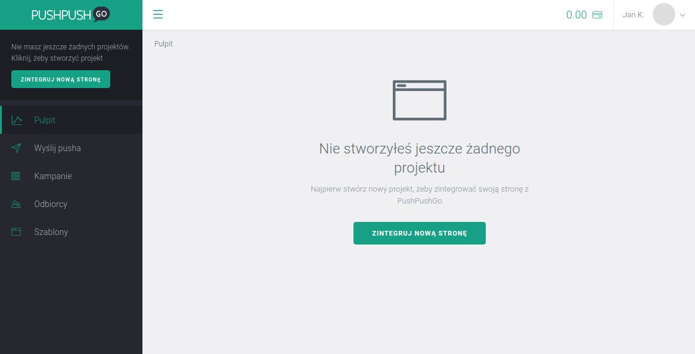
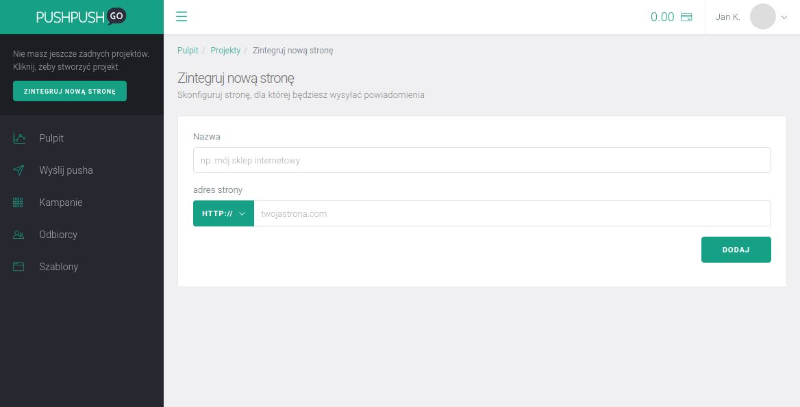
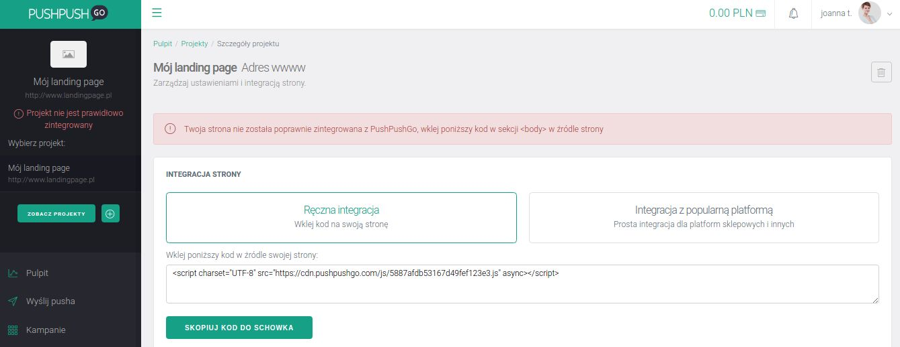
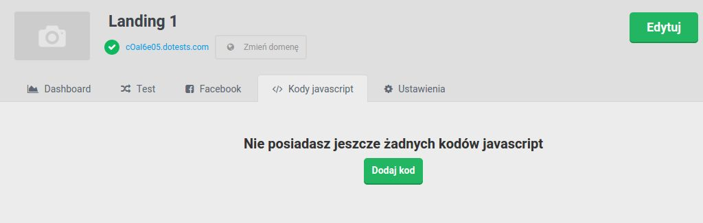
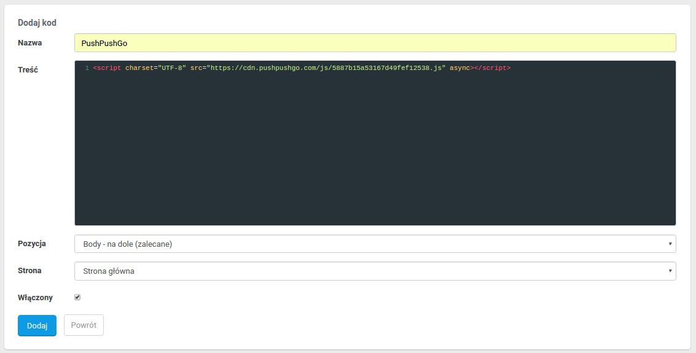
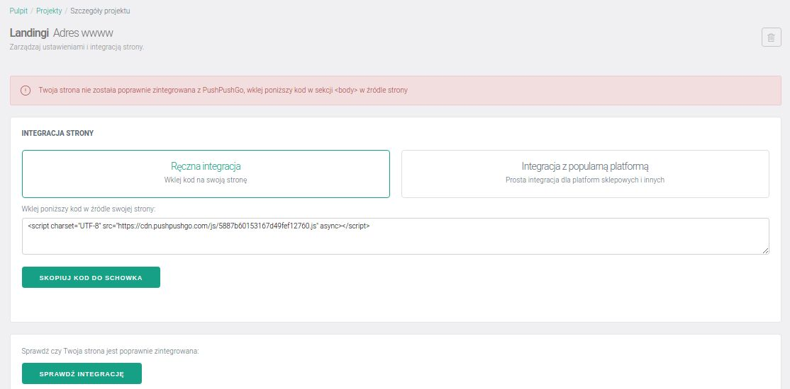

Generujesz wysokiej jakości leady wykorzystując platformę [Landingi.pl](http://www.landingi.pl)? Skorzystaj z dodatkowej możliwości kontaktu z klientami i oprócz zbierania maili i danych odbiorców zaproponuj im także *subskrypcję powiadomień web push* od PushPushGo.

Web push na Twoim landingu to:

- *5 razy wyższy wskaźnik kliknięć* niż w przypadku email marketingu, czyli 5 razy więcej szans na dotarcie do klientów z Twoim komunikatem,
- baza odbiorców zbudowana *30 razy szybciej* niż za pomocą subskrypcji email,
- zasięg *80% użytkowników* internetu, do których dotrzesz na desktopy oraz urządzenia mobilne,
- nawet *10% wzrost* konwersji na Twoim landingu.

We współpracy z Landingi.pl stworzyliśmy krótką instrukcję, dzięki której w 5 minut zintegrujesz swój landing z PushPushGo, wystarczy, że będziesz postępować zgodnie z poniższymi krokami.

1. *1.* Najpierw [załóż własne darmowe konto w PushPushGo](https://app.pushpushgo.com). Pamiętaj, że masz, aż *14 dni* na bezpłatne testowanie naszej aplikacji. Uzupełnij poniższe dane i przejdź do kolejnego kroku.

2. *2.* Następnie kliknij przycisk *Zintegruj nową stronę*, aby wygenerować unikatowy kod integracyjny dla swojego landingu. Po jego wklejeniu na landingu będziesz mógł od razu zacząć prowadzić własne kampanie web push.

3. *3.* Nadaj *nazwę* swojemu projektowi (pamiętaj, że będzie się ona wyświetlać odbiorcom w oknie potwierdzającym zapis) i podaj adres www swojej strony.
Pamiętaj, że jeśli zmienisz potem domyślny adres www swojego landingu na własną domenę, musisz go również zmienić w ustawieniach projektu w PushPushGo.

4. *4.* Kliknij przycisk *Ręczna integracja*, aby wygenerować unikatowy kod integracyjny dla swojego landingu.

5. *5.* W kolejnym kroku przejdź do panelu Landingów i wklej kod integracyjny na swoim landingu, klikając zakładkę *Kody javascript* i *Dodaj kod*.

6. *6.* Nazwij swoją integrację i wklej w sekcji body na dole kod integracyjny, po czym kliknij *Dodaj*.

7. *7.* Wróć do panelu PushPushGo i sprawdź czy integracja przebiegła pomyślnie, w tym celu kliknij przycisk *Sprawdź integrację*.

8. *8.* Zielony komunikat u góry strony poinformuje Cię o poprawnej integracji.

*Gotowe!* Możesz już zacząć wysyłać własne kampanie web push ze swojego landingu. Przetestuj wskazówki z naszego [Poradnika Użytkownika](https://pushpushgo.com/pl/pages/poradnik/), aby wystartować z pierwszą kampanią.

