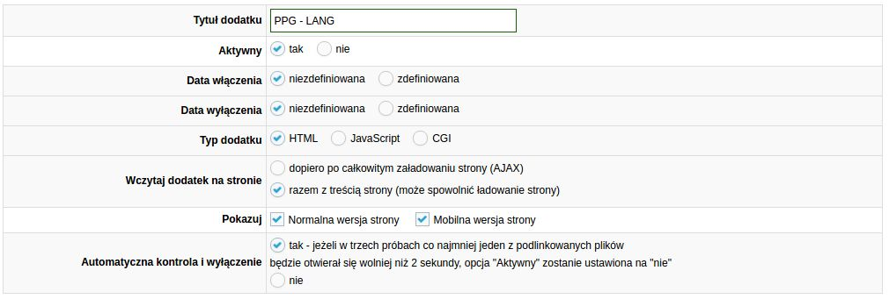
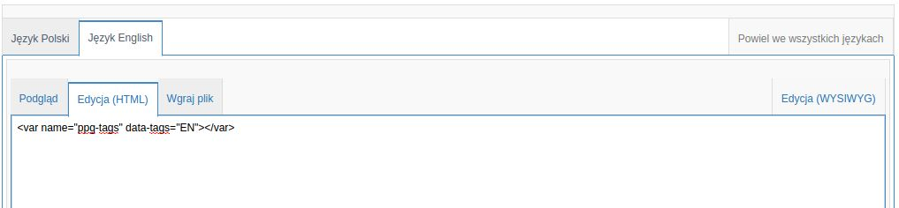
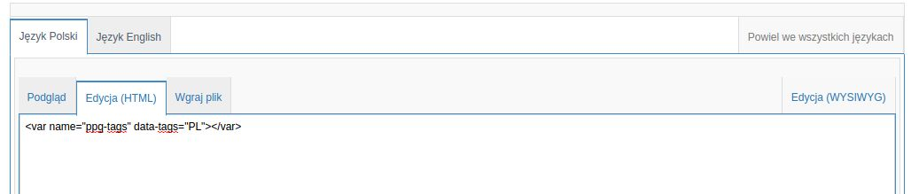
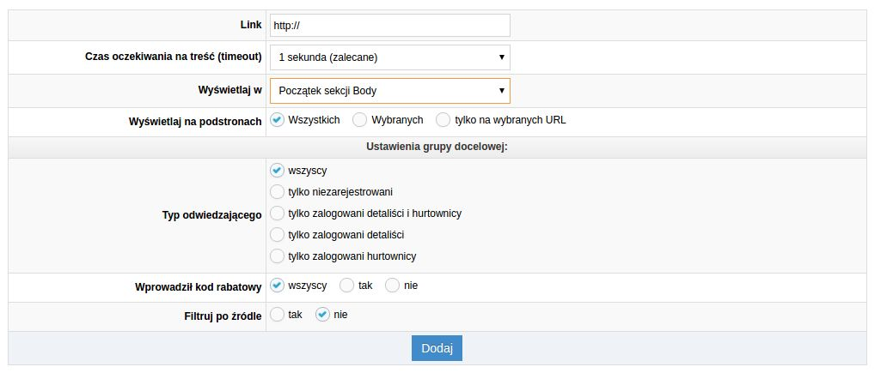

### Różne wersje językowe sklepu - jak wysyłać notyfikacje web push?

Wiele sklepów internetowych posiada kilka wersji językowych na raz, tak aby móc obsługiwać klientów z różnych krajów lub po prostu posługujących się innym językiem, ale mieszkających w Polsce.

Dzięki PushPushGo możesz wysyłać do swoich odbiorców także notyfikacje web push w różnych językach, wszystko z poziomu jednego konta.

Jeśli chcesz targetować kampanie po języku wybranym przez odbiorcę, skorzystaj z jednej z porad opisanych w tym poradniku.
Dla Twojej wygody podzieliliśmy go na podrozdziały w zależności od tego, w jaki sposób wersje językowe zaimplementowane są w Twoim sklepie.

## W moim sklepie każdy język jest zaimplementowany na osobnej subdomenie

W tym przypadku posiadasz dedykowane subdomeny dla każdej z wersji językowych sklepu, np. angielski: en.mojsklep.com czy niemiecki: de.mojsklep.com.

W tej sytuacji wystarczy, że z poziomu jedngo konta w PushPushGo stworzysz dwa odrębne projekty dla każdej z subdomen i będziesz tworzyć notyfikacje web push w danym języku.

Masz wtedy pewność, że odbiorca zrozumie komunikat z notyfikacji i przejdzie na stronę.

## W moim sklepie zmiany językowe są obsługiwane przez silnik sklepu/strony

Przy takich ustawieniach, to w jakim języku strona wyświetla się odbiorcy, zależy od ustawień platformy z jakiej korzystasz.

Aby dostosować język powiadomień web push do języka Twoich odbiorców zastosuj tagi. Są to krótkie fragmenty kodu HTML rozpoznawalne przez system PushPushGo. Nie mają one żadnego wpływu na inne funkcjonalności Twojego sklepu.

W tym celu na podstronach sklepu w języku polskim dodaj tagi:
```
<var name="ppg-tags" data-tags="PL"></var>
```
Na podstronach sklepu w języku angielskim dodaj tagi:

```
<var name="ppg-tags" data-tags="EN"></var>
```

Identycznie w przypadku każdego innego języka, oczywiście, jeżeli tylko system CMS np. udostępnia odpowiednie *zmienne*, które możesz wykorzystać.
Najlepiej wprowadzić je dynamicznie, w głównym layoucie strony w sekcji &ltbody&gt, np.
```
<var name="ppg-tags" data-tags="{$site->zmienna_jezykowa}"></var>
```

Takie rozwiązanie może wymagać wsparcia technicznego danej platformy/systemu cms lub programisty, jednak znacznie podnosi skuteczność komunikatów web push a wiele popolarnych platform udostępnia tego typu gotowe snippety.

Poniżej znajdziesz przykład takiego wdrożenia z platformą IAI-Shop.com.

## Przykład wprowadzenia tagów na platformie IAI-Shop
Po zintegrowaniu się z platformą PushPushGo, w panelu IAI-Shop w menu moderacji przejdź do *Dodatków HTML i Javascript*. Następnie kliknij na kampani *PushPushGo* -> Operacje na dodatkach *[Edytuj]*.

1. Następnie kliknij *Nowy dodatek +*

2. Wpisz jego nazwę np. *PPG - Tag Lang* i wybierz opcje:

  - Aktywny: TAK
  - Pokazuj - Zaznacz: normalna i mobilna,
  - Wczytaj dodatek na stronie - 2 opcja czyli razem z treścią strony

  

3. Uzupełnij kod snippetu:

 - Przejdź do sekcji niżej i kliknij język Polski
 - Wklej - w zakładce Edycja HTML:
```
<var name="ppg-tags" data-tags="PL"></var>
```
 - Kliknij Język Angielski i wklej w zakładce Edycja HTML:
```
  
```
<var name="ppg-tags" data-tags="EN"></var>
```
  

4. Na samym dole strony wybierz opcję:
 - Wyświetlaj w: Początek sekcji body

5. Kliknij dodaj.
  

6. Na koniec sprawdź na liście dodatków czy jest on aktywny. Jeżeli nie, edytuj go jeszcze raz i kliknij aktywność na tak, po czym zapisz zmiany.
  

  I gotowe!