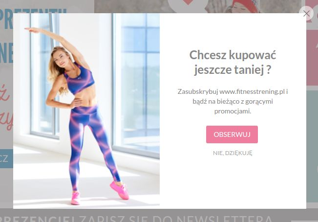
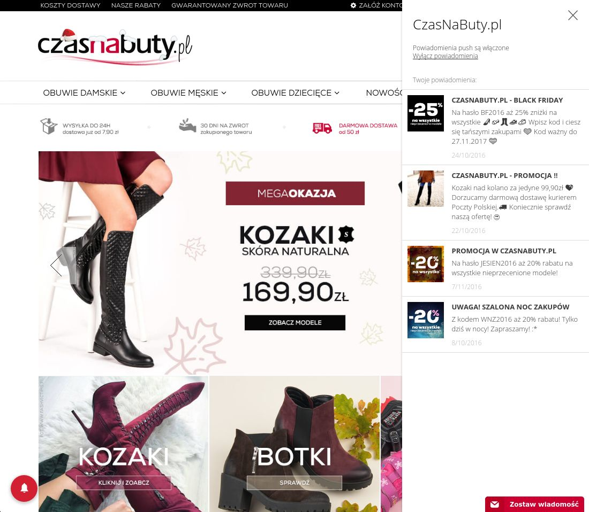
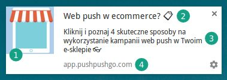

Email marketing generuje średnio [18% wszystkich zamówień w sektorze ecommerce](http://blog.custora.com/2016/05/custora-e-commerce-pulse-report-q1-2016/). Wraz z rozwojem możliwości jakie oferują nowoczesne przeglądarki internetowe, doczekał się jednak poważnego konkurenta.

Prowadzisz *newsletter* w swoim sklepie internetowym? Zauważyłeś, że Twoje kampanie często *lądują w spamie*? A może Twoi Klienci nie chcą się zapisywać się na wiadomości mailowe? Sprawdź czy *notyfikacje web push* nie są dobrym rozwiązaniem dla Ciebie.

Z tego artykułu dowiesz się jakie są najważniejsze różnice pomiędzy newsletterem a web push, *które odczujesz w swoim sklepie internetowym*.

***
Zobacz też:

***

- [5 zastosowań powiadomień web push dla każdej firmy](http://centrumsprzedawcy.pl/5-zastosowan-powiadomien-web-push-dla-kazdej-firmy/)

- [4 wskazówki, które zwiększą skuteczność Twoich kampanii web push](https://pushpushgo.com/pl/blog/post/improve-push-campaigns/)

## E-mail a web push - podobieństwa

Żeby porównać e-mail i notyfikacje web push jako narzędzia marketingowe, warto najpierw zwrócić uwagę na podobieństwa w modelu działania obydwóch kanałów.

Notyfikacje web push z powodzeniem *pełnią w sklepie internetowym* funkcje identyczne jak email marketing. Pozwalają one m.in.:

- zwiększać ruch i *generować sprzedaż* (ponieważ wyświetlają się odbiorcy nawet wtedy, gdy przegląda inną stronę internetową),
- budować *rozpoznawalność marki* oraz lojalność odbiorców (przyzwyczajają się oni do stałego rytmu Twoich kampanii),
- *edukować* rynek, (np. poprzez przesyłane artykuły poradnikowe odnośnie Twoich produktów),
- przeprowadzać *ankiety* i badania satysfakcji.

Idea email marketingu oraz web push opiera się też na zasadzie *marketingu za przyzwoleniem*. Aby otrzymywać powiadomienia, najpierw należy *zapisać się na subskrypcję*, co mocno wpływa na poziom zaangażowania odbiorców, którzy sami wybierają jakie informacje chcą otrzymywać od sklepów.

Formularz zapisu na powiadomienia web push, FitnessTrening.pl

Zarówno w przypadku e-maila jak i powiadomień web push, głównym celem przekazu jest zdobycie uwagi odbiorcy i skłonienie go do *kliknięcia i przejścia na stronę z daną ofertą*. Służą do tego odpowiednio dobrane zdjęcia oraz treść przedstawiająca korzyści jakie otrzyma odbiorca klikając w link.

Marketerzy zwracają też uwagę, iż subskrybenci wielokrotnie wracają, np. do kodów rabatowych zawartych w mailingu, aby sfinalizować zakup w wygodnym dla siebie momencie.

W przypadku niektórych platform web push mają oni również możliwość powrotu do wcześniej wysłanych powiadomień w *dedykowanej skrzynce odbiorczej*, tak jak w przypadku email marketingu.

Różnicą jest to, że zawiera ona jedynie powiadomienia z Twojej strony internetowej. Niweluje to problem różnych rozpraszaczy, które dekoncentrują odbiorcę podczas przeglądania poczty mailowej. Właśnie dlatego powiadomienia web push tak dobrze konwertują.

Źródło: Skrzynka odbiorcza powiadomień web push, CzasNaButy.pl

Warto również zwrócić uwagę, że jeśli chodzi o [cenę usług](https://pushpushgo.com/pl/#prices) model rozliczeń z reguły zależy od ilości posiadanych subskrybentów lub występuje w formie prepaid, sprawiając że miesięczne koszty korzystania z obu rodzajów systemów są bardzo porównywalne.

## Newsletter a notyfikacje web push - różnice

Jak widać na powyższych przykładach, email marketing oraz web push marketing są bardzo podobnymi narzędziami jeśli chodzi o schemat działania, co je w takim razie różni? Poniżej znajdziesz *8 najważniejszych różnic* pomiędzy e-mailem a powiadomieniami web push w przypadku ecommerce.

### 1. Czas tworzenia kampanii

Nośnikiem przekazu marketingowego w przypadku kampanii email jest masowo wysyłana wiadomość do skrzynek odbiorców. Jej zaprojektowanie *wymaga więc znajomości zasad*, dzięki, którym *dotrze ona do inboxów* oraz prawidłowo wyświetli się odbiorcom. Dodatkowo zasady te są znacząco inne w przypadku różnych dostawców poczty.

W przypadku powiadomień web push, za dostarczenie i wysyłkę kampanii odpowiada *dana przeglądarka internetowa*. Zasady tworzenia wiadomości są wspólne dla wszystkich z nich, unikasz więc ryzyka, że mały błąd w kreacji sprawi, że cała kampania wyląduje w spamie.

Własną kampanię web push stworzysz w kilku kliknięciach, nie posiadając wiedzy programistycznej ani marketingowej. Wystarczy, że wybierzesz:

- *grafikę wyróżniającą*, która skupi uwagę na promowanym przez Ciebie produkcie,
- *tytuł* czyli chwytliwe hasło opisujące produkt, które możesz urozmaicić emotikonami,
- *treść główną* czyli krótkie rozwinięcie opisu produktu,
- *link do strony*, na którą odbiorca zostanie odesłany po kliknięciu komunikatu.

***

Czas potrzebny na zaprojektowanie kampanii

***

- *Email: > 5 minut*. Może być dowolnie długi i zawierać dowolną ilość zdjęć i linków. Wymaga przeprowadzenia testów kampanii przed wysyłką, ponieważ łatwo może wpaść do spamu, gdy jest źle zaprojektowany.

- *Web push: < 5 minut*. Notyfikacja posiada ograniczoną ilość znaków tytułu i treści głównej, jedno zdjęcie oraz link docelowy. Nie wymaga przeprowadzania testów przed wysyłką, nie ma błędów technicznych, które miałyby wpływ na dostarczalność kampanii.

***

### 2. Czas wysyłki

Czas od stworzenia kampanii email marketingowej do jej dostarczenia do skrzynek odbiorców może być bardzo różny w zależności od stopnia skomplikowania kreacji a także ilości adresów w danej bazie. Czasami wysyłka dużej ilości wiadomości *może trwać nawet kilka godzin*.

Ponieważ notyfikacje web push *obsługiwane są przez przeglądarkę internetową* ich wysyłka odbywa się w czasie rzeczywistym. Pozwala to natychmiast reagować na zachowania odbiorców na stronie sklepu, wtedy gdy ich zaangażowanie i szansa na sprzedaż są największe.

***

Czas potrzebny na dostarczenie kampanii

***

- *Email: > kilku minut*
Nie masz wpływu na czas dostarczenia kampanii email

- *Web push: < 10 sekund*
Notyfikacje web push dotrą na przeglądarki Twoich odbiorców praktycznie natychmiast.

***

### 3. Zasięg odbiorców

Potencjalny zasięg Twoich działań email marketingowych może objąć [97% internautów](http://www.wirtualnemedia.pl/artykul/97-proc-polskich-internautow-korzysta-z-poczty-e-mail), gdyż właśnie tylu Polaków posiada własną skrzynkę mailową.

Powiadomienia web push wspierane są przez [największe nowoczesne przeglądarki internetowe oraz platformy mobilne](https://pushpushgo.com/pl/blog/post/push-support/), oferując tym samym zasięg ok. *80% globalnych użytkowników internetu.

***

Zasięg działań

***

- *Email:* ok. *97%* użytkowników internetu

- *Web push:* ok. *80%* użytkowników internetu + w tym potencjalni odbiorcy, którzy obawiają się spamu, ponieważ w przypadku web push każdy odbiorca może samodzielnie wypisać się z subskrypcji. Całkowicie niweluje to problem spamu w komunikacji marketingowej.

***

### 4. Dostarczalność

Na ograniczenia dostarczalności kampani email znaczący wpływ mają *filtry antyspamowe*, które mogą zablokować pojedynczą wysyłkę ze względu na zawarty w niej błąd lub wszystkie przyszłe wysyłki danego marketera, np. na podstawie zgłoszeń spamu ze strony jego odbiorców.

W przypadku notyfikacji web push, na dostarczalność kampanii nie mają wpływu *ad-blockery*, które zapobiegają wyświetlaniu reklam na stronach internetowych ani filtry antyspamowe. Dostarczalność kampanii web push zależy tylko tego jak wielu odbiorców kampanii ma włączone lub włączy urządzenie (desktop, mobile) po tym jak komunikat został wysłany.

***

Dostarczalność kampanii

***

- *Email:* dostarczalność kampanii zależy od jej aspektów technicznych, *reputacji danego IP*, z którego kampania jest wysyłana oraz reakcji odbiorców na poprzednie wiadomości tego typu

- *Web push:* dostarczalność kampanii zależy od tego ilu odbiorców ma włączoną lub włączy przeglądarkę po tym jak kampania została wysłana

***

### 5. Przetwarzanie danych osobowych

Zgodnie z polskim prawem adresy email traktowane są jako dane osobowe. Prowadząc więc działania email marketingowe jesteś zmuszony do podjęcia formalnych działań jak, np. *rejestracja bazy subskrybentów w Giodo.*

Natomiast na powiadomienia web push, Twoi odbiorcy zapisują się dwoma kliknięciami i nie potrzebujesz w tym celu *ani adresu email, ani żadnych innych danych*. Tym samym nie musisz się martwić ich kłopotliwym przechowywaniem.

***

Obowiązek zbierania i rejestrowania danych osobowych

***

- *Email:* masz prawny obowiązek rejestrowania i ochrony danych osobowych odbiorców

- *Web push:* nie potrzebujesz żadnych danych osobowych odbiorców.

***

### 6. Mechanizm wypisu z subskrypcji

Gdy marketer nie umieści w swoim newsletterze linku wypisu, w przypadku większości skrzynek *subskrybent nie ma możliwości wypisania się z subskrypcji*, co sprzyja nadużyciom oraz wysyłaniu SPAMU.

Jeśli chodzi o działania web push odbiorca *ma w każdym momencie możliwość wypisania się z powiadomień* z poziomu swojej przeglądarki. Sprawia to, że web push marketerzy dużo częściej przestrzegają zasad permission marketingu i nie zalewają odbiorców dużą ilością niepotrzebnych komunikatów.

***

Zagrożenie spamem

***

- *Email:* odbiorca jest w większości przypadków uzależniony od nadawcy, przy usunięciu linku wypisy nie ma jak zrezygnować z subskrypcji.

- *Web push:* odbiorca może się wypisać z subskrypcji w każdym momencie za pośrednictwem swojej przeglądarki internetowej

***

### 7. Statystyki wysyłek

Jak wynika z najnowszego [Raportu Strategicznego IAB Polska](http://iab.org.pl/aktualnosci/raport-strategiczny-iab-polska-internet-20152016/), średni wskaźnik kliknięć (CTR) w newsletterach wynosił *w Polsce w 2015 roku 4,3%*. Kiedy wskaźnik otwarć (OR) wynosił *16,57%*.

Jeśli chodzi o statystyki kampanii web push, wskaźnik otwarć jest jednocześnie, wskaźnikiem kliknięć, gdyż notyfikacja zawiera tylko jeden link i jej kliknięcie jest równoznaczne z przejściem na stronę docelową. Z analiz *PushPushGo* wynika, że średni wskaźnik kliknięć powiadomień push wynosi *ok. 20%.*

Panel raportów PushPushGo

***

 Średni CTR (wskaźnik kliknięć) kampanii

***

- *Email:* 4,3%

- *Web push:* 20%

***

### 8. Szybkość budowania bazy odbiorców

Na szybkość przyrostu ilości subskrybentów mailowych znaczący wpływ ma *obligatoryjne podanie adresu email*, co sprawia, że konwersja formularza zapisu może być niższa niż w przypadku web push. Dodatkowym ograniczeniem jest też często przymusowe dokończenie zapisu w modelu double opt-in, który wymaga zalogowania do skrzynki mailowej i kliknięcia w link.

W przypadku web push, najlepiej konwertujące formularze zapisu pozwalają na wzrost bazy odbiorców *nawet o 50-u dziennie*.

***

Przyrost bazy odbiorców

***

- *Email:* umiarkowanie szybki

- *Web push:* bardzo szybki

***

### Podsumowanie

Oczywiście nawet posiadając powyższe dane trudno rozstrzygnąć, które z narzędzi: email czy notyfikacje web push, ma do zaoferowania więcej właścicielom sklepów internetowych oraz marketerom. Oba te kanały mogą być niezwykle skuteczne w przypadku realizacji różnych celów marketingowych, dlatego wykorzystanie ich synergii powinno przynieść najwięcej korzyści jeśli chodzi o prowadzenie działań wielokanałowych.

