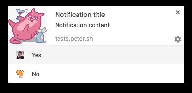

Każda przeglądarka obsłuje powiadomienia web push w inny sposób. Notyfikacje mogą różnić się wyglądem, działaniem, funkcjami oraz implementacją.

W zależności od tego, na jakiej przeglądarce użytkownik wyraził zgodę na otrzymywanie powiadomień, będzie on otrzymywał je w określonej formie.

### Google Chrome

Chrome może pochwalić się bardzo dobrym wsparciem powiadomień web push na desktop'ach oraz urządzeniach mobilnych (*Chrome for Android*).

Podstawowe powiadomienie składa się z obrazka, tytułu, treści i linka, a limity dla notyfikacji to *50* znaków dla tytułu, *120* znaków dla treści.

Od wersji Chrome 50 (marzec 2016) pushe zostały wzbogacone o akcje polubienia i odpowiedzi. W zależności od tego jakie akcje dostępne są w dostarczonej notyfikacji, użytkownik może polubić jej treść lub odpowiedzieć na pytanie, wybierając jedną z opcję z listy.

### Firefox

W Firefoxie powiadomienia wspierane są od wersji 44, gdzie początkowo zawierały logo przeglądarki, ikonę, tytuł i maksymalnie 20-znakową treść.

W ostatniej wersji 47 możemy zaobserowować, że wyglądem upodobniły się do powiadomień wysyłanych przez Google Chrome.

Zwiększono także limity dla notyfikacji i w tej wersji ustalono: *50* znaków dla tytułu, *200* znaków dla treści.

### Safari

Safari wprowadziło możliwość wysyłania powiadomień push od wersji 7.

### Opera

Opera w wersji 25 wprowdziła notyfikacje dla desktopów (rok 2014) .

Niedawno, w czerwcu 2016, *Opera for Android* wprowadziła notyfikacje w mobilnej wersji przeglądarki.

### Internet Explorer

Internet Explorer wprowadził notyfikacje web push w wersji Edge, na urządzeniach PC oraz tabletach z systemem operacyjnym Windows 10. Notyfikacje dla wszystkich klientów, będą dostępne dopiero od wersji [Edge na silniku EdgeHTML 14](https://blogs.windows.com/msedgedev/2016/05/16/web-notifications-microsoft-edge/).

### Wsparcie w PushPushGo

Na obecną chwilę wspieramy wysyłkę powiadomień na przeglądarkach Google Chrome od wersji 49 oraz Firefox od wersji 44. Niebawem do listy wspieranych przez nas przeglądarek dołączą także Opera, Safari, a następnie Internet Explorer.

