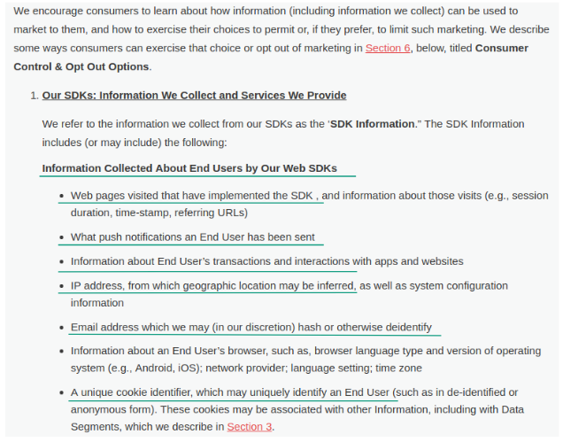

Każdy przedsiębiorca czy firma, która **sprzedaje swoje produkty lub usługi obywatelom i firmom na terenie Unii Europejskiej**, musi dostosować swoje wewnętrzne procesy do wymogów RODO (lub zagranicznego GDPR). Te same regulacje dotyczą również tych podmiotów, które **nie prowadzą działalności gospodarczej**, ale przetwarzają dane osobowe swoich odbiorców czy czytelników. Do takiej grupy można zaliczyć m.in. blogerów, którzy prowadzą newsletter.

Temat RODO budzi w Europie wiele kontrowersji ze względu na milionowe kary i nowe a czasami uciążliwe obowiązki organizacyjne, które narzuca podmiotom, które mają kontakt z danymi osobowymi klientów. Duża część tych kontrowersji wynika z niewiedzy samych firm! Właśnie dlatego, żeby oswoić ten temat przygotowaliśmy cykl krótkich artykułów, w których znajdziecie merytoryczne i treściwe odpowiedzi na najczęściej zadawane pytania odnośnie RODO.

W tej części znajdziecie informacje:

- czy europejskie firmy mogą wykorzystywać **amerykańskie narzędzia** jak np. MailChimp, do przetwarzania danych osobowych,
- czy będzie można korzystać z **bezpłatnych platform do wysyłki notyfikacji web push**, jak np. OneSignal.

Żeby dowiedzieć się więcej na temat tego jak zmiany, które niesie za sobą RODO wpłyną na Twoją pracę jako marketera czy właściciela firmy, pobierz też nasz bezpłatny ebook:

## RODO. Z jakich narzędzi marketingowych nie będzie można korzystać?

Musimy zacząć od tego, że RODO nie zakazuje wprost korzystania z żadnych narzędzi marketingowych. W rozporządzeniu nie znajdziemy gotowej listy firm, z którymi nie możemy współpracować przy przetwarzaniu danych osobowych naszych klientów.

Pełna **odpowiedzialność za wybór odpowiedniego dostawcy spoczywa na firmie, która go zatrudnia**. To ona poniesie konsekwencje za korzystanie z usług instytucji, które np. złamały prawa jej klientów.

Jeśli myślisz, że „jakoś uciekniesz” od ujawniania informacji o tym co dalej robisz z danymi klientów i z kim współpracujesz, przytoczę **przykład z branży B2B**, który szybko wyprowadzi Cię z błędu.

Niedawno podpisywaliśmy umowy z kilkoma polskimi bankami, które już od dawna są przygotowane na zmiany związane z RODO. Mimo, że korzystanie z notyfikacji web push nie wiąże się z przetwarzaniem danych osobowych, musieliśmy dla nich sporządzić listę wszystkich podmiotów, z którymi współpracujemy z dokładnym opisem jakie informacje podczas tej współpracy są między nami wymieniane.

Jednym słowem, europejskie firmy zaczęły już dbać o bezpieczeństwo i rozliczalność w przypadku danych swoich klientów. Nikt nie zaufa Ci „na słowo”, ponieważ sam musi później udowodnić, że ze swojej strony podjął wszystkie możliwe działania, aby zapewnić zgodność swoich procesów z nowym prawem.

### Pytanie 1: Czy europejskie firmy mogą wykorzystywać amerykańskie narzędzia jak np. MailChimp, do przetwarzania danych osobowych?

RODO nie zakazuje wykorzystywania amerykańskich narzędzi do przetwarzania danych osobowych, nie ma też na celu **zablokowania wymiany tego typu informacji pomiędzy UE a USA**.

Oczywiście w przypadku europejskich dostawców szansa, że przestrzegają oni wymogów RODO jest dużo większa, amerykańskie prawo jest bowiem dużo bardziej liberalne. Często Ty jako przedsiębiorca czy marketer masz również większe możliwości kontaktu z nimi i weryfikacji tego co rzeczywiście dzieje się powierzanymi im informacjami.

Ciężko liczyć, że chociażby Facebook podpisze z Tobą jakikolwiek dokument, w którym zadeklaruje się co dokładnie robi z danymi Twoich klientów i zgodzi się np. na kary umowne w przypadku ew. incydentu bezpieczeństwa.

Mimo to, przepisy RODO jasno stwierdzają, że wystarczy, że tylko jeden z poniższych warunków będzie spełniony, abyś mógł przesyłać dane osobowe do danego kontrahenta:

- podmiot amerykański wpisany jest na tzw. listę **Privacy Shield**,
- przekazanie danych do USA jest **niezbędne do wykonania umowy** między Tobą a osobą, do której dane należą (np. gdy świadczysz usługi kurierskie w USA, ponieważ nie było by to możliwe bez przekazania danych nadawcy czy odbiorcy przesyłki),
- osoba, której dane dotyczą, poinformowana o ewentualnym ryzyku, wyraźnie **wyraziła zgodę na przekazanie swoich danych**. Nie musi być to zgoda spisana w formie papierowej, ważne żeby była wyraźna, musisz móc ją w jakiś sposób wykazać,
- podpiszesz z podmiotem amerykańskim rozbudowaną umowę zgodną z tzw. **standardowymi klauzulami umownymi**, których wzór wyznacza Komisja Europejska.

### Pytanie 2: Czy będzie można korzystać z bezpłatnych platform do wysyłki notyfikacji web push, jak np. OneSignal?

W przypadku tego pytania warto zacząć od pewnej oczywistości. **Nie ma w biznesie czegoś takiego jak „darmowy obiad” czy darmowe narzędzie do czegokolwiek**. Model freemium jest jeszcze w Polsce dosyć mało znany i rzeczywiście niektórzy przedsiębiorcy, z którymi rozmawiam czasami się na to nabierają.

Każda platforma marketingowa, która jest w stanie świadczyć swoje usługi bezpłatnie dla Ciebie, musi komuś oferować usługi, które są płatne. Kluczowe jest więc pytanie na czym rzeczywiście zarabia platforma, za którą Ty nie musisz płacić.

W kontekście RODO nie jest więc ważne czy płacisz za korzystanie z platformy za pośrednictwem, której przetwarzasz dane osobowe klientów tylko czy zapewnia ona bezpieczeństwo tych danych na poziomie wymaganym w UE. Sprawdź też o [jakie inne kwestie warto zapytać, zanim podpiszesz umowę z dostawcą web push](https://pushpushgo.com/pl/blog/post/wybor-aplikacji-web-push/).

Tak jak pisałam w poprzednim paragrafie, **w procesie wysyłki notyfikacji web push nie są wykorzystywane dane osobowe**. Jednak ze względu na to, że dostawca web push ma dostęp do wielu informacji, które przetwarzane są za pośrednictwem Twojej strony www, mogą to również być dane osobowe: jak imię i nazwisko, adres email itd.

Jeśli chodzi o przykład OneSignal wszystkie kluczowe kwestie możesz sprawdzić w polityce prywatności tej firmy. Dowiesz się z niej m.in. że elementem jej modelu biznesowego jest zbieranie informacji i przekazywanie ich do podmiotów trzecich w celach reklamowych:

*Źródło: Polityka Prywatności OneSignal, dostęp: 10.04.2018 r.*

Aby móc świadczyć Ci bezpłatnie usługi wysyłki notyfikacji web push, OneSignal zbiera i przekazuje do firm trzecich informacje:

- jakie kampanie web push wysyłasz,
- jakie transakcje wykonują Twoi klienci,
- adresy email, które wykorzystują na stronie Twoi klienci,
- adresy IP Twoich klientów,
- czy ciasteczka, które pozwalają na identyfikację Twoich klientów.

*Źródło: Polityka Prywatności OneSignal, dostęp: 10.04.2018 r.*

Niestety zarówno w polityce prywatności czy warunkach korzystania z serwisu tego dostawcy web push, nie znalazłam bardziej precyzyjnych danych: co to za firmy trzecie lub po co i dokładnie jakie informacje z Twojej strony one otrzymują.

Zanim więc podpiszesz jakąkolwiek umowę na użytkowanie platformy marketingowej, sprawdź dokładnie na jaki rodzaj współpracy się piszesz i czy na pewno będzie ona pozostawała w zgodzie z tym co narzuca Ci europejskie prawo.

Macie jeszcze inne pytania odnośnie RODO? Śmiało zadawajcie je w komentarzach, a my odpowiemy na nie w kolejnych częściach naszego poradnika. Do zobaczenia!

