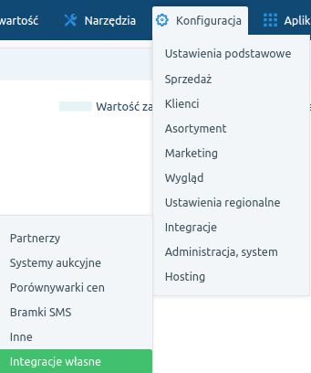
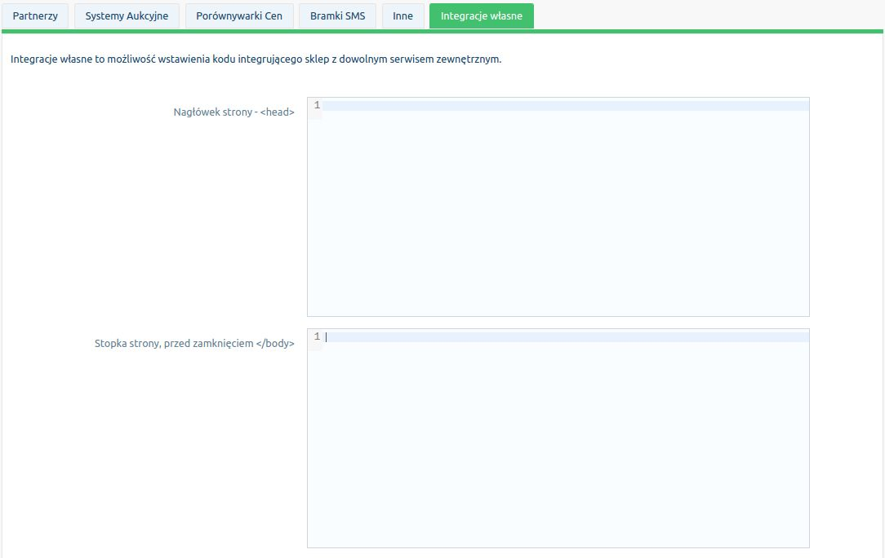
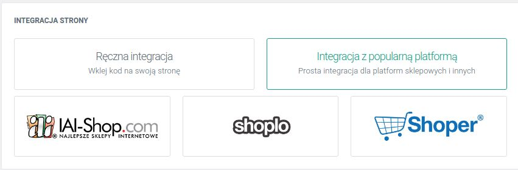
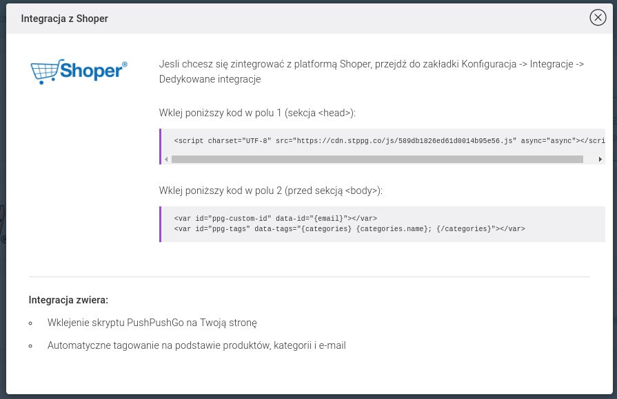
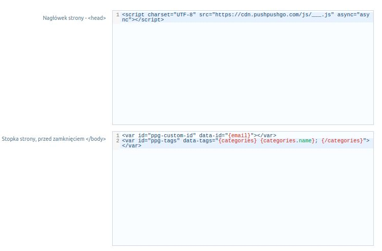
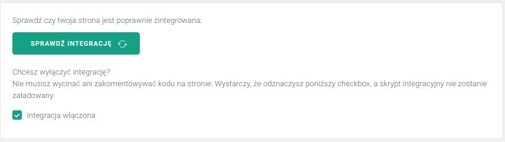
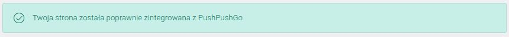

### Instrukcja integracji PushPushGo z platformą Shoper

Dzięki integracji platformy Shoper i PushPushGo, zyskujesz:

 - Nowy i skuteczny kanał komunikacji ze swoimi klientami poprzez komunikaty wyświetlane na stronie Twojego sklepu oraz wtedy, gdy odbiorca przegląda inne strony www,
 - Możliwość generowania sprzedaży, dzięki dedykowanym rabatom i zniżkom wysyłanym tylko do subskrybentów,
 - Automatyczne oznaczanie subskrybentów na podstawie oglądanych produktów czy kategorii - wysyłaj wiadomości tylko do określonej grupy subskrybentów,
 - Możliwość analizowania zachowania odbiorców na stronie i bardziej precyzyjnego odpowiadania na ich potrzeby.

## Instrukcja

1. Aby zintegrować sklep w Shoper z PushPushGo, zaloguj się najpierw do swojego panelu administracyjnego na platformie [Shoper](https://shoper.pl).

2. Następnie z menu po lewej stronie wybierz opcję *Konfiguracja* -> *Integracje* -> *Integracje własne*.

  
  

3. Zaloguj się lub utwórz konto na platformie [PushPushGo](https://app.pushpushgo.com/#register) w osobnej karcie.

4. Kliknij przycisk *Stwórz nowy projekt* i uzupełnij dane tj. *Nazwa sklepu* oraz jego *prawidlowy adres URL*.

5. Następnie w oknie projektu, przejdź do zakładki *Integracja z popularną platformą* i wybierz *Shoper*.
  
  

7. Przekopiuj wartości dla sekcji *&lt;head&gt;* i to samo zrób z sekcją przed końcem *&lt;/body&gt;* w *Integracjach własnych*
  

8. *Zapisz zmiany.* Przejdź do *PushPushGo* i kliknij *Sprawdź integrację*
  

9. Poniższy komunikat poinformuje Cię, że integracja została zakończona sukcesem.
  

Od tego momentu Twoi odbiorcy będą otrzymywać komunikat z zaproszeniem do zapisu na Twoje powiadomienia.
Gdy wyrażą taką zgodę będziesz mógł pozostać z nimi w kontakcie nawet wtedy, gdy nie będą znajdować się na Twojej stronie lub wyłączą przeglądarkę.

Jeśli zajdzie taka potrzeba, Integrację zawsze możesz dezaktywować bezpośrednio z panelu PushPushGo.