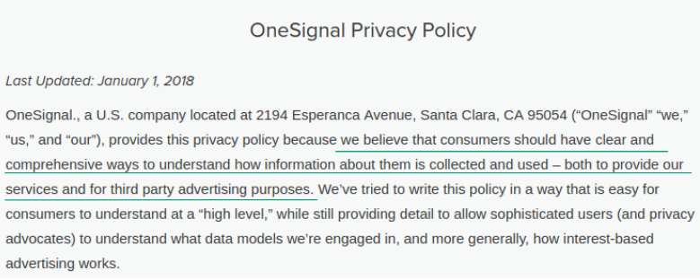
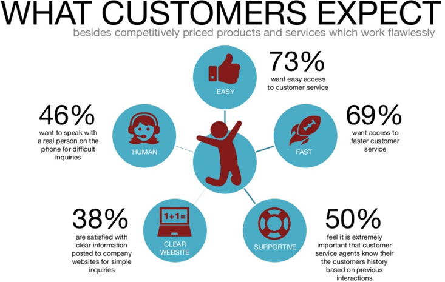

Notyfikacje web push zapoczątkowały przełom w dziedzinie marketingu internetowego. Ze względu na możliwość **natychmiastowego kontaktu z subskrybentem**, bez udziału jego skrzynki mailowej, ten młody wynalazek zdążył zdominować tradycyjny newsletter jeśli chodzi o [wskaźniki skuteczności](https://pushpushgo.com/pl/blog/post/newsletter-vs-webpush/)

Wiesz już pewnie, że w związku z tym platform do wysyłki notyfikacji web push pojawiło się na rynku naprawdę dużo. Proponowane przez nie **funkcjonalności oraz pakiety cenowe** są do siebie bardzo podobne. Jednym słowem, łatwo pogubić się we wszystkich ofertach i wybrać taką, która odpowie na potrzeby firmy, jednocześnie zapewniając jej niezbędną ochronę danych osobowych i wsparcie we wdrożeniu narzędzia.

Jeśli właśnie stoisz przed wyborem aplikacji do powiadomień web push, nie musisz już dłużej przedzierać się przez hasła marketingowe, które nie informują o niczym konkretnym. Istnieją **obiektywne czynniki**, które mają wpływ na to czy będzie ona dobra dla Ciebie i Twojej firmy. Skoro istnieją, możesz o nie zapytać każdego dostawcę a podczas bezpłatnego okresu testowego przekonasz się tylko, że podjąłeś dobrą decyzję.

W tym artykule znajdziesz **5 obowiązkowych pytań**, które powinieneś zadać swojemu dostawcy web push zanim podpiszesz jakąkolwiek umowę, wraz z odpowiedziami, które byłoby idealnie abyś otrzymał.

Na końcu artykułu, możesz również pobrać gotową checklistę, którą tylko wyślesz wybranym dostawcom, aby wybrać tego najlepszego dla Ciebie i gotowe!

## 1. Czy wasza platforma korzysta z silnika OneSignal lub innych pośredników?

OneSignal to multiplatforma web push, która oprócz tego, że pozwala firmom samodzielnie wysyłać notyfikacje, **udostępnia też silnik**, dzięki któremu można zbudować własną platformę web push.

Jedyny problem dla Ciebie może wynikać z tego, że ta platforma jest bezpłatna. Brzmi to pewnie absurdalnie, bo wszyscy lubimy bezpłatne usługi. Jednak jak to bywa w internecie, nic co jest darmowe nie jest w rzeczywistości darmowe. OneSignal w swojej [polityce prywatności](https://onesignal.com/privacy_policy) wprost informuje o tym, że częścią jego modelu biznesowego jest kooperacja z podmiotami trzecimi w celach reklamowych.

*Źródło: Polityka Prywatności OneSignal, dostęp: 8.02.2018 r.*

Jednym słowem, aby korzystanie z platformy było bezpłatne - zbiera, przetwarza i przekazuje do firm trzecich dane pozyskiwane na stronach swoich klientów:

- **jakie kampanie** web push wysyłasz,
- **jakie transakcje** wykonują Twoi klienci,
- **adresy email**, które wykorzystują na stronie Twoi klienci,
- **adresy IP** Twoich klientów
- czy **ciasteczka**, które pozwalają na identyfikację Twoich klientów.

Jest to możliwe, dzięki kodowi integracyjnemu, który wklejasz na swojej stronie, aby móc wysyłać z niej notyfikacje.

*Źródło: Polityka Prywatności OneSignal, dostęp: 8.02.2018 r.*

Ryzyka, które wynikają dla Ciebie i Twojej firmy z tego powodu to chociażby udostępnianie bliżej nieokreślonym podmiotom trzecim know how handlowego, np. jakie produkty i w jakiej cenie sprzedajesz.

W świetle zmian odnośnie ochrony danych osobowych, które wprowadza RODO niepewność powinno budzić przede wszystkim **pozyskiwanie adresów email Twoich klientów** (które stanowią dane osobowe) oraz oznaczanie ich ciasteczkami, które są później dalej odsprzedawane.

Zgodnie z nowym rozporządzeniem UE masz obowiązek informować swoich klientów o tym i uzyskać ich zgodę na przetwarzanie danych czy profilowanie. W tym przypadku może być to trudne, ponieważ OneSignal nie informuje dokładnie o tym do jakich firm dane te są przekazywane i w jakim konkretnie celu, np. lepszego targetowania reklam w sieci reklamowej XYZ.

**Odpowiedź idealna**

*Nie korzystamy z silnika OneSignal, ani żadnych innych pośredników tego typu. Nasza platforma to autorskie rozwiązanie, mamy więc pełną kontrolę nad tym co się dzieje z danymi naszych klientów i możemy potwierdzić jak, gdzie i po co są one dla Państwa zbierane.*

**Na co zwrócić uwagę**

Również w Polsce funkcjonują platformy web push, które korzystają z silnika OneSignal, bardzo często nie informując swoich klientów o konsekwencjach, które się z tym wiążą. To z jakiego silnika korzysta dana platforma web push można oczywiście sprawdzić, więc jeśli masz wątpliwości poproś o pomoc kogoś ze swojego działu IT.

## 2. Czy mogę przenieść bazę subskrybentów z waszej platformy do innej?

Wielu marketerów przyzwyczajonych do tego jak działają platformy email marketingowe zakłada, że wyeksportowanie listy subskrybentów z jednego narzędzia i zaimportowanie ich do kolejnego jest czymś oczywistym.

W przypadku bazy web push, taka operacja jest możliwa tylko jeżeli obecny dostawca utworzy dla Ciebie klucze GCM/FCM zanim zaczniesz zbierać własną bazę odbiorców.

**Odpowiedź idealna**

*Oczywiście, jeżeli chcą Państwo korzystać z eksportu subskrybentów w przyszłości zapewnimy dla Państwa klucze GCM/FCM i wyjaśnimy mechanizm ich działania.*

**Na co zwrócić uwagę**

Upewnij się, że dostawca web push, z którym rozmawiasz nie proponuje Ci eksportu danych o subskrybentach np. w formacie CSV. Wówczas są to dane jedynie analityczne, które możesz np. otworzyć i przejrzeć w excelu, ale nie będą się nadawać do zaimportowania do innej platformy, z której chcesz prowadzić wysyłki kampanii.

## 3. Czy wasz kod integracyjny nie spowalnia działania strony i nie będę musiał go zmieniać w przyszłości?

Aby zacząć zbierać subskrybentów web push na swojej stronie, musisz wkleić w jej źródle kod integracyjny wygenerowany z platformy, z którą będziesz współpracować w tym zakresie.

Jak każde narzędzie IT, może on być stworzony w mniej lub bardziej optymalny sposób, co ma wpływ na **szybkość ładowania Twojej witryny**, a co za tym idzie, **jej pozycję w wynikach wyszukiwania Google**.

Drugą kwestią, którą powinieneś sprawdzić jest to, czy kod wkleja się jednorazowo **czy będziesz go musiał zmienić** np. za każdym razem gdy dostawca platformy wprowadzi na niej jakieś zmiany. Oczywiście, w tym przypadku nie jest to jakiś bardzo poważny problem, jednak na pewno zmarnujesz trochę czasu, co nigdy nie jest pożądane.

**Odpowiedź idealna**

*Nasz kod integracyjny jest napisany w języku ......., nie spowalnia ładowania strony klienta ani nie wymaga zmian w przyszłości.*

**Na co zwrócić uwagę**

Gdy masz wątpliwości, zawsze możesz poprosić o opinię programistę, który wkleja dla Ciebie kod na stronie. Widząc strukturę skryptu będzie on w stanie zweryfikować jakie akcje dokładnie na niej wywołuje i czy będzie go trzeba zmieniać w przyszłości.

## 4. Czy żeby korzystać z marketing automation muszę wklejać na mojej stronie jakieś dodatkowe skrypty od was?

Moduły web push automation, w zależności od tego jak zostały zaprojektowane, mogą działać w różny sposób. Oczywiście każdy z nich będzie skuteczny, ale mając na uwadze własny interes powinieneś szukać rozwiązania najwygodniejszego dla Ciebie.

Co to oznacza? Przykładowo, jeżeli w swoim sklepie internetowym posiadasz 1000 produktów i będziesz musiał każdy z nich oznaczyć specjalnym skryptem osadzonym na swojej stronie, żeby automatyzować na tej podstawie kampanie… zmarnujesz sporo czasu.

Istnieje wiele skutecznych sposobów automatyzowania notyfikacji web push, naprawdę nie jesteś skazany na żmudne wklejanie wielu niepotrzebnych skryptów lub wdrożenia, które trwają wiele tygodni, ponieważ zespół IT dostawcy platformy musi modyfikować kod Twojej strony.

**Odpowiedź idealna**

*Nasz moduł marketing automation to w pełni działające narzędzie już w momencie wklejenia w źródle strony kodu integracyjnego.*

**Na co zwrócić uwagę**

Kluczowa jest ilość dodatkowych operacji, które będziesz musiał wykonać po swojej stronie od momentu integracji z dostawcą web push.

Oczywiście, wklejenie jednego czy dwóch dodatkowych parametrów, zwłaszcza, gdy wymaga tego dedykowane rozwiązanie, o które prosisz, to nie koniec świata. W przypadku, gdy takich operacji będziesz musiał wykonać już 100, z pewnością jest to trochę niepotrzebnie wykonana praca.

## 5. Jakie wsparcie klienta oferujecie?

Decydując się na współpracę z daną platformą web push, w pakiecie powinieneś otrzymać nie tylko samo narzędzie, ale także niezbędne wsparcie podczas jego użytkowania.

Bez tego wiele czasu poświęcisz na szukanie własnych rozwiązań, zamiast skorzystać z już gotowych. Nie jesteś ekspertem we wszystkim, dostęp do odpowiednio przedstawionej wiedzy ma więc bezpośredni wpływ na skuteczność Twoich działań web push.

To czego warto szukać to:

- **bezpłatne materiały self-service**: poradniki, filmiki, case study, z których będziesz mógł samodzielnie skorzystać w dowolnej chwili, w takiej formie, w której Tobie będzie najwygodniej,
- **kanały** jakimi możesz kontaktować się z obsługą platformy i **godziny, kiedy jest ona dostępna**. Pamiętaj, że jeżeli dana platforma oferuje Ci wsparcie tylko wtedy, gdy w Twoim kraju jest np. noc lub nie oferuje jej w Twoim planie wcale, zostaniem kompletnie sam z problemem, który pojawia się z reguły w najmniej spodziewanym momencie,
- **dedykowane wsparcie** - czasami warto zdać się na czyjeś doświadczenie. Skorzystanie z gotowej strategii web push może przyspieszyć Twoje działania i na pewno uchroni Cię przed popełnieniem niepotrzebnych błędów.

**Odpowiedź idealna**

*Do Państwa dyspozycji pozostaje nasz dział client service, dostępny w Państwa pakiecie bezpłatnie/w cenie …….. Support jest dostępny 24 godziny na dobę, poprzez: chat, email, telefon.*

*Dla naszych klientów tworzymy również dedykowane strategie web push i chętnie służymy radą we wszystkich kwestiach z tym związanych.*

**Na co zwrócić uwagę**

Zanim podpiszesz umowę z dostawcą web push na dłuższy okres, lepiej sprawdź czego się spodziewać. Opinie o danej platformie czy to na Facebooku czy Google Moja Firma, przynajmniej po części wskażą Ci jakiego poziomu client service się spodziewać.

Zła obsługa klienta to coś co się zapamiętuje i wielu użytkowników od razu daje temu wyraz w swoich opiniach w mediach społecznościowych. Wiedząc wcześniej, że np. dany dostawca ma bardzo niskiej jakości wsparcie, unikniesz rozczarowania w przyszłości.

*Źródło: http://www.slideshare.net/thorleifhallund/why-service-matters*

Gratulacje! Teraz jesteś w pełni przygotowany, aby podjąć świadomą decyzję o wyborze idealnego dostawcy notyfikacji web push dla Ciebie.

Poniżej możesz pobrać bezpłatną checklistę, którą tylko wyślesz wybranym firmom. Powodzenia w poszukiwaniach!

<a class="btn" href="checklista.png" target="_blank" download>
Pobierz checklistę
</a>

