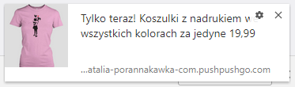
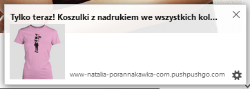
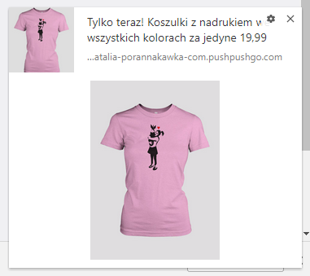
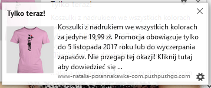
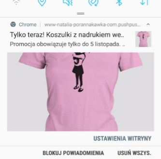

Przygotowanie skutecznej kampanii web push na pierwszy rzut oka wydaje się być prostym zadaniem. 
Polega przecież na wprowadzenieniu **tytułu, treści oraz grafiki** tak by zachęcić odbiorcę do kliknięcia w powiadomienie.

W rzeczywistości jednak, taka krótka forma wiadomości, wymaga bardzo sprytnego podejścia i maksymalnego wykorzystania każdego jej elementu. Warto pamiętać, że choć wymienione wcześniej elementy możemy edytować, to **ostateczna forma w jakiej pojawi się notyfikacja, uzależniona jest od przeglądarki**, z której korzysta odbiorca.

Z tego artykułu dowiesz się jak poszczególne przeglądarki wpływają na:
- maksymalną ilość znaków w tytule,
- maksymalną ilość znaków w treści,
- obrazki, które zamieszczamy w powiadomieniu.

 
### Tytuł

*Chrome*

W przypadku Google Chrome tytuł może zawierać maksymalnie 2 linijki tekstu, co daje około **54 znaki ze spacjami**. Przy dłuższym tytule przeglądarka ucina tekst na końcu drugiej linii, dodając trzykropek.

Mając na uwadzę krótki czas wyświetlania powiadomienia warto ograniczyć tytuł do jednej linii. Zwięzły i chwytliwy tytuł pozytywnie wpłynie na decyzję o kliknięciu w powiadomienie.

Jeśli chcemy by tytuł **zmieścił się jednej linijce, powinien zawierać około 27 znaków**.

*Mozilla Firefox*

W Firefoxie natomiast, tytuł powinien mieć **około 50 znaków**. W tej przeglądarce nagłówek zawsze pozostanie w jednej linijce.

### Treść

*Chrome*

Przy jedno linijkowym tytule w notyfikacji możemy zawrzeć aż 5 linii treści. Maksymalna ilość znaków, którą można zamieścić w treści powiadomienia **to około 120**.   Przeglądarka oferuje także możliwość zamieszczenia większego obrazka, kosztem tekstu. Jest to tzw. rich push. Wówczas treść jest ograniczana do jednej linii, co pozwala na **użycie około 54 znaków w treści**.

*Mozilla Firefox*

Długość treści powiadomienia w Firefox, podobnie jak w Chrome, ograniczona jest ilością linijek. Przybliżona ilość znaków, które zmieszczą się w takim powiadomieniu **wynosi 198**.

Ciekawym zachowaniem w przypadku tej przeglądarki jest zmienna szerokość powiadomienia. Przykładowo jeśli nie postawimy spacji pomiędzy kolejnymi wyrazami okienko będzie rozszerzać się wraz z dodaniem kolejnych znaków.

### Grafika

**Ikona**

Zarówno Chrome jak i Mozilla Firefox dają możliwość zamieszczenia ikony powiadomienia. Obrazek taki powinien posiadać **proporcje kwadratu, czyli 1:1**. By zachować wystarczająco wysoką jakość obrazka można użyć grafiki o wymiarach 150x150px.

**Rich push**

Przeglądarka Google Chrome pozwala na dołączenie do powiadomienia dużego zdjęcia, które wyświeli się bezpośrednio pod jego treścią.

Wytyczne co do proporcji i rozdzielczości dużego obrazka są **różne dla powiadomień wyświetlanych na desktopie i na urządzeniach mobilnych**.

*Desktop*

Optymalne proporcje dla dużego obrazka na desktopie to **3:2**. Minimalna wysokość grafiki wynosi 240px, natomiast szerokość jest dowolna. Jeśli jednak chcemy zachować ideane proporcje i wysoką jakość obrazka, warto przygotować ją w **wymiarach minimum: 360x240px**.

*Mobile*

W przypadku urządzeń mobilnych ważne jest by **zawsze stosować proporcję 2:1**, w innym wypadku grafika zostanie ucięta. By zachować wysoką jakość obrazka należy przygotować ją w wymiarach 500x1000px.

Warto zauważyć, że zastosowanie dużego zdjęcia zarówno na mobile jak i desktop skutkuje ucięciem właściwej treści do jednej linii.

Przykładowy wygląd notyfikacji web push **bez dużego zdjęcia** na mobile:

Przykładowy wygląd notyfikacji web push **z dużym zdjęciem** na mobile:

